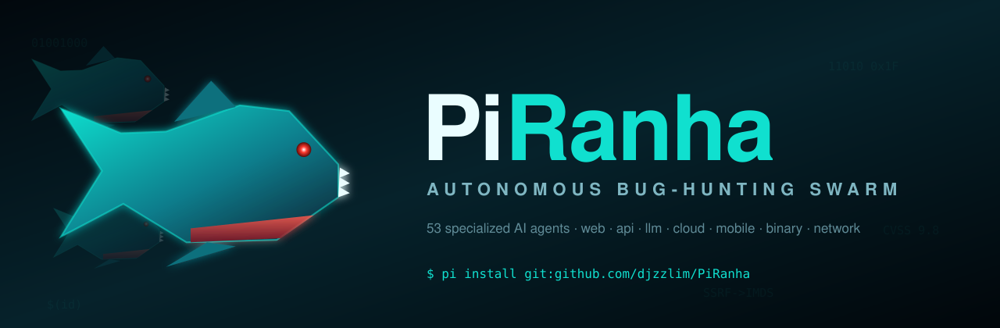
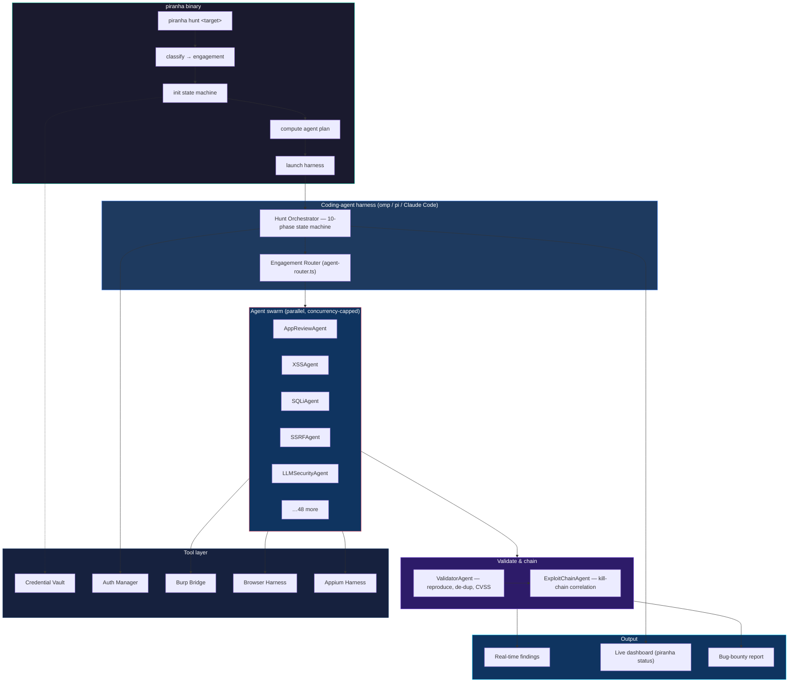

<p align="center">
  
</p>

<h1 align="center">🐟 PiRanha</h1>

<p align="center">
  <strong>The Autonomous Bug-Bounty Swarm</strong>
</p>

<p align="center">
  <em>A school of <b>53 specialized AI security agents</b> + a deterministic engagement router that classify any target and strip it to the bone — in parallel.</em>
</p>

<p align="center">
  <code>curl -fsSL https://raw.githubusercontent.com/h4ckologic/PiRanha/main/install.sh | sh</code>
  <br/>
  <sub>or as a Pi package — <code>pi install git:github.com/h4ckologic/PiRanha</code></sub>
</p>

<p align="center">
  <a href="#why-piranha">Why PiRanha</a> &bull;
  <a href="#install">Install</a> &bull;
  <a href="#agents">The Swarm</a> &bull;
  <a href="#architecture">Architecture</a> &bull;
  <a href="#sample-prompts">Prompts</a> &bull;
  <a href="#contributing">Contributing</a>
</p>

<p align="center">
  
  
  
  
  
  
  
</p>

<p align="center">
  <sub>web &middot; api &middot; graphql &middot; llm &amp; agentic/mcp &middot; mobile (android/ios) &middot; binary &amp; firmware &middot; cloud (aws/azure/gcp/k8s) &middot; network &amp; active directory</sub>
</p>

---

## Why PiRanha?

A single scanner is a shark — one big jaw, slow, easy to see coming. **PiRanha is a swarm.**

Drop it on a target and a *school* of small, hyper-specialized hunters hits the water at once. Each agent knows exactly one thing — SSTI, IAM privilege escalation, Kerberoasting, MCP tool-poisoning, request smuggling — and goes straight for it. A deterministic router decides which piranhas to release based on what the target *is*. A validator spits out the false positives. An exploit-chain agent stitches the individual bites into a kill. Nothing is left on the bone.

| The piranha 🐟 | PiRanha 🤖 |
|---|---|
| A swarm of small, specialized fish | 53 single-purpose security agents |
| Each strikes the part it is built for | Per-vuln-class expertise, hypothesis-driven |
| The school coordinates the attack | Engagement router + true parallel dispatch |
| Strips a target in seconds | Recon → profile → swarm → validate → chain |
| Smells blood from far away | AppProfile finds where the bugs actually live |

> Named for the [Pi](https://pi.dev) harness it ships on — and for what the swarm does to a target.

---

## Install

### Binary (recommended)

PiRanha ships as a single self-contained `piranha` binary — like [omp](https://omp.sh) — so you can classify a target, compute the swarm's deployment plan, and manage hunt state without any harness, then launch the agentic hunt inside one.

```sh
# macOS · Linux
curl -fsSL https://raw.githubusercontent.com/h4ckologic/PiRanha/main/install.sh | sh

# Windows (PowerShell)
irm https://raw.githubusercontent.com/h4ckologic/PiRanha/main/install.ps1 | iex

# Already have bun? Install from source instead of the prebuilt binary
curl -fsSL https://raw.githubusercontent.com/h4ckologic/PiRanha/main/install.sh | sh -s -- --source

# Pin a release tag / commit / branch
curl -fsSL https://raw.githubusercontent.com/h4ckologic/PiRanha/main/install.sh | sh -s -- --ref v2.0.0
```

The installer drops a self-contained `piranha` into `~/.local/bin` — either the prebuilt release binary, or compiled on the spot from source with bun (`bun build --compile`). Then wire the swarm into your harness and hunt:

```sh
piranha doctor                 # check prerequisites + harness
piranha install                # register the skill with omp / pi or Claude Code
piranha hunt https://app.example.com --mode pentest
```

`piranha hunt` classifies the target, initializes the state machine, computes the routed agent plan, then launches the swarm inside whatever harness is on your PATH (omp / pi or Claude Code). The deterministic surface (`plan`, `status`, `agents`, `vault`) runs fully standalone.

| Command | Does |
|---|---|
| `piranha hunt <target>` | Classify + launch a hunt (`--mode`, `--engagement`, `--creds`, `--harness`, `--resume`, `--dry-run`) |
| `piranha status [target]` | Live hunt dashboard, or list all sessions |
| `piranha plan <target\|type>` | Print the deterministic agent deployment plan |
| `piranha agents [type]` | List routed agents (all, or per engagement) |
| `piranha engagements` | List engagement types + aliases |
| `piranha vault …` | Encrypted credential vault (`--store` / `--get` / `--list` / `--delete` / `--redact`) |
| `piranha install` | Register the swarm skill with your harness |
| `piranha update` | Update the binary to the latest release |
| `piranha doctor` | Check prerequisites + environment |
| `piranha completions <shell>` | Emit a bash / zsh / fish completion script |

Shell completions are generated from the live command metadata (omp-style):

```sh
eval "$(piranha completions zsh)"     # zsh  → add to ~/.zshrc
eval "$(piranha completions bash)"    # bash → add to ~/.bashrc
piranha completions fish > ~/.config/fish/completions/piranha.fish
```

### As a Pi package

PiRanha is a [Pi](https://pi.dev) package. The repo ships a `pi` manifest in `package.json`, so Pi auto-discovers the skill and registers the `/skill:piranha` command.

```bash
# Install from GitHub (a pinned tag/commit ref is recommended for reproducibility)
pi install git:github.com/h4ckologic/PiRanha

# Try it for a single session, without installing
pi -e git:github.com/h4ckologic/PiRanha

# Project-scoped install (writes .pi/settings.json — shareable with your team)
pi install -l git:github.com/h4ckologic/PiRanha

# Then, inside pi:
/skill:piranha hunt https://app.example.com
```

**How the package is wired** (`package.json`):

```json
{ "name": "piranha", "keywords": ["pi-package"], "pi": { "skills": ["./skills"] } }
```

Pi recursively loads `skills/BugBountyFramework/SKILL.md` as the **`piranha`** skill (Pi allows the skill name to differ from its directory, which keeps every internal tool path intact). The Bun tools — `agent-router.ts`, `hunt-orchestrator.ts`, `credential-vault.ts`, and the rest — are harness-agnostic and self-locating, so they run unchanged under Pi.

> **Tri-harness:** the same swarm runs three ways — the standalone `piranha` binary (above), a Pi package (this section), and Claude Code (`piranha install` copies the skill into `~/.claude/skills`). All three share one set of agent definitions, router, and Bun tools. One runtime note: the parallel agent-dispatch in Phase 5 uses the Claude-Code `Agent({…})` API; under Pi/omp the equivalent is the built-in `task` tool.

Manage the package with `pi list`, `pi update piranha`, and `pi remove piranha`. PiRanha appears in the [Pi package gallery](https://pi.dev/packages) once published (tagged `pi-package`).

## What is PiRanha?

**PiRanha** is an **autonomous bug-bounty swarm**. The `piranha` binary classifies a target, initializes a phase-tracked state machine, computes a deterministic agent deployment plan, then launches a *school* of **53 specialized vulnerability agents** inside a coding-agent harness (omp / pi or Claude Code) — each agent hunting one vuln class in parallel.

```sh
# One command. Autonomous hunting.
piranha hunt https://app.example.com
```

**What happens next:**
1. The target is classified into one of 16 engagement types and the matching workflow loads
2. A state machine initializes and tracks the 10 phases of the hunt (`piranha status` / `--resume` anytime)
3. Credentials are loaded from an encrypted vault (never inline)
4. The app is profiled — flows mapped, tech stack fingerprinted, trust boundaries identified
5. Hypothesis-driven agents deploy in parallel — each with a specific attack theory
6. Findings are validated, deduped, chained, and CVSS-scored — then a bug-bounty report is generated

---

## PiRanha vs. Manual Bug Bounty

| Manual Bug Bounty | PiRanha |
|---|---|
| Hours of recon before first payload | Autonomous recon → profiling → attack in minutes |
| Forget where you left off between sessions | State machine checkpoints every phase — `--resume` anytime |
| Credentials in plaintext notes | Encrypted vault with 1Password integration |
| Run same tools blindly on every target | Hypothesis-driven: agents attack WHERE the AppProfile says bugs live |
| Test one thing at a time | Dozens of agents run in parallel per phase, findings shared in real-time |
| Miss AI/LLM vulnerabilities | Dedicated LLMSecurityAgent (OWASP LLM Top 10) + AIAgentExploitationAgent (tool-calling / MCP / agentic) |
| Medium findings silently dropped | Mediums archived for attack chain correlation |
| No memory between hunts | Cross-session learning — gets smarter with every engagement |
| Single tool / single domain | 53 agents across 16 engagement types — web, API, LLM, mobile, cloud, network, binary |

---

## What's in the box

The `piranha` binary and the `BugBountyFramework` swarm skill ship together in this repo:

| Component | Count | What |
|---|---|---|
| **`piranha` binary** | 1 | Standalone launcher — classify, plan, state, vault, launch (compiled with `bun build --compile`) |
| **Specialized agents** | 53 | 51 hunters/specialists + ValidatorAgent + ExploitChainAgent |
| **Engagement types** | 16 | web, api, llm, android, ios, mobile, binary, firmware, thick-client, cloud (+aws/azure/gcp), kubernetes, network, recon |
| **Workflows** | 8 | W_HUNT_WEB / API / LLM / MOBILE / NETWORK / CLOUD / THICK_CLIENT + W_RECON |
| **Bun tools** | 7 | orchestrator, agent-router, credential-vault, auth-manager, burp-bridge, browser & appium harnesses |
| **Report templates** | 2 | BugReport.md, TargetConfig.md |

The state machine, deterministic router, encrypted vault, hunt modes, and live dashboard are all driven through the binary or the skill. No external service is required to classify a target, compute a plan, or track hunt state.

### Optional: the full PAI environment

PiRanha was built inside — and plugs into — a larger offensive-security setup: [PAI](https://github.com/danielmiessler/PAI) (the Algorithm, cross-session memory, a wider security-skill stack, expert agents, lifecycle hooks), the Claude Code `superpowers` plugin, and MCP servers (Burp Suite, Shodan, VirusTotal, …). **None of it is required to run a hunt** — it's an optional power-up. The complete, step-by-step replication guide lives in **[SETUP.md](SETUP.md)**.

---

## Architecture



---

## Quick Start

The fastest path — install the binary, then hunt:

```sh
curl -fsSL https://raw.githubusercontent.com/h4ckologic/PiRanha/main/install.sh | sh
piranha install
piranha hunt https://app.example.com
```

Or clone and install from source (Claude Code):

```bash
git clone https://github.com/h4ckologic/PiRanha.git
cd PiRanha
./install.sh
```

For the **full setup with PAI, Superpowers, and all security skills**, see the [Full Setup Guide](SETUP.md).

---

## Full Setup Guide

See **[SETUP.md](SETUP.md)** for the complete, step-by-step guide to replicate the full infrastructure:

1. Install prerequisites (Claude Code, Bun, Go tools, Burp Suite)
2. Install PAI v3.0 (the foundation)
3. Configure your identity (DA + Principal)
4. Install plugins (Superpowers, claude-mem, ui-ux-pro-max)
5. Configure MCP servers (Burp, Filesystem, GitHub)
6. Install BugHunter AI skill
7. Set up optional security MCPs (Shodan, VirusTotal, NVD)
8. Configure notifications (ntfy, Discord, Twilio)
9. Verify the installation

---

## Hunt Modes

| Mode | CVSS Threshold | Finding Target | Best For |
|------|----------------|----------------|----------|
| `bounty` (default) | >= 8.0 | 10 | Bug bounty programs — only critical/high findings |
| `pentest` | >= 4.0 | 20 | Penetration tests — comprehensive coverage |
| `comprehensive` | >= 0.0 | 50 | Full security audits — everything documented |

```bash
piranha hunt https://target.com                       # bounty mode (default)
piranha hunt https://target.com --mode pentest        # pentest mode
piranha hunt https://target.com --mode comprehensive  # comprehensive mode
```

---

## Agents

PiRanha deploys **53 specialized agents**, each an expert in one vulnerability class or domain. Hunter agents find bugs; two meta-agents (ValidatorAgent, ExploitChainAgent) reproduce, de-dup, and weaponize them into chains. A deterministic router (`Tools/agent-router.ts`) selects and orders agents per engagement type:

| Agent | Focus | Key Techniques |
|-------|-------|----------------|
| **AppReviewAgent** | Application understanding | Flow mapping, tech fingerprinting, trust boundary analysis |
| **LLMSecurityAgent** | AI/LLM vulnerabilities | OWASP LLM Top 10, prompt injection, RAG poisoning |
| **XSSAgent** | Cross-site scripting | Reflected, stored, DOM-based, mutation XSS |
| **SQLiAgent** | SQL injection | Union, blind, time-based, second-order SQLi |
| **SSRFAgent** | Server-side request forgery | Cloud metadata, internal services, protocol smuggling |
| **IDORAgent** | Insecure direct object refs | Horizontal/vertical privilege escalation, UUID prediction |
| **AuthAgent** | Authentication bypass | JWT attacks, session fixation, OAuth flaws, MFA bypass |
| **APIAgent** | API security | BOLA, mass assignment, rate limiting, GraphQL introspection |
| **CORSAgent** | CORS misconfiguration | Origin reflection, null origin, wildcard subdomains |
| **FileUploadAgent** | File upload attacks | Content-type bypass, polyglot files, path traversal |
| **XXEAgent** | XML external entities | Blind XXE, OOB data exfiltration, SSRF via XXE |
| **RCEAgent** | Remote code execution | Command injection, SSTI, deserialization, SSRF→RCE |
| **BusinessLogicAgent** | Business logic flaws | Race conditions, price manipulation, workflow bypass |
| **MobileAgent** | Android/iOS security | SSL pinning bypass, exported components, insecure storage |
| **WindowsAgent** | Windows/AD attacks | Kerberoasting, NTLM relay, privilege escalation |
| **ReconAgent** | Reconnaissance | Subdomain enum, port scanning, tech fingerprinting |
| **ReverseEngineeringAgent** | Binary analysis | Static analysis, dynamic analysis, vulnerability identification |
| **ExploitDevAgent** | Exploit development | PoC creation, payload crafting, reliability testing |
| **DesktopAppAgent** | Desktop app security | Electron, .NET, Java app testing |
| **GraphQLAgent** | GraphQL security | Introspection, batch abuse, nested DoS, relay IDOR, subscription hijack |
| **WebSocketAgent** | WebSocket security | CSWSH, message injection, origin bypass, auth hijacking |
| **CSRFAgent** | CSRF exploitation | Token/SameSite/Referer bypass, content-type tricks, CORS+CSRF chains |
| **CachePoisoningAgent** | Web cache poisoning | Unkeyed header injection, cache deception, CDN-specific bypasses |
| **HTTPSmugglingAgent** | HTTP request smuggling | CL.TE, TE.CL, H2.CL desync, response queue poisoning |
| **SubdomainTakeoverAgent** | Subdomain takeover | Dangling DNS, cloud service fingerprinting, cookie/CSP impact |
| **RaceConditionAgent** | Race conditions | HTTP/2 single-packet attack, limit bypass, double-spend, TOCTOU |
| **PrototypePollutionAgent** | Prototype pollution | Client-side PP→XSS gadgets, server-side PP→RCE, AST injection |
| **LLMAgent** | Legacy LLM testing | Basic prompt testing (superseded by LLMSecurityAgent) |
| **SSTIAgent** | Server-side template injection | Per-engine RCE: Jinja2/Twig/Smarty/Freemarker/Velocity/Pebble/Thymeleaf/ERB/Handlebars/Pug/Razor/Go, sandbox escape, blind OOB |
| **CommandInjectionAgent** | OS command injection | In-band/blind/time-based, OOB exfil, argument & option injection, IFS/wildcard WAF bypass, *nix + Windows |
| **DeserializationAgent** | Insecure deserialization | Gadget chains for Java (ysoserial), .NET (ViewState/Json.NET), PHP (phpggc/phar), Python (pickle), Ruby, Node |
| **NoSQLiAgent** | NoSQL injection | Operator/JS injection, auth bypass, blind regex/time extraction — MongoDB/CouchDB/Redis/Cassandra/Elasticsearch |
| **PathTraversalAgent** | Path traversal / LFI / RFI | Encodings, PHP wrappers, log poisoning, /proc, session poisoning, zip-slip, cloud-cred file read |
| **CRLFAgent** | CRLF / response splitting | Header & response-line injection → XSS, cache poison, session fixation, host-header & email-header injection |
| **OAuthAgent** | OAuth2 / OIDC / SAML / SSO | redirect_uri abuse, state CSRF account-linking, PKCE downgrade, SAML XSW, jku/x5u SSRF, pre-account ATO |
| **OpenRedirectAgent** | Open redirect (chain primitive) | Bypass arsenal + chains: OAuth code/token theft, SSRF allow-list bypass, CSP bypass, reflected→stored |
| **SecretsExposureAgent** | Exposed secrets / info disclosure | .git/.env dump, source-map reconstruction, debug endpoints, validated live secrets (trufflehog/gitleaks) |
| **CloudExploitationAgent** | Cloud / IAM / k8s priv-esc | IMDS→cred theft, IAM priv-esc paths, S3/blob takeover, kubelet/etcd/API, container escape (pacu/cloudfox/peirates) |
| **SupplyChainAgent** | Supply chain / CI-CD | Dependency confusion, leaked registry/CI tokens, GitHub Actions PPE, unpinned actions, vuln deps (gato/osv-scanner) |
| **AIAgentExploitationAgent** | Agentic AI / tool-calling / MCP | Indirect injection → tool call, MCP tool poisoning/rug-pull, excessive agency, memory poisoning (MITRE ATLAS) |
| **ValidatorAgent** | Finding validation / triage | Clean-room reproduction, false-positive killer, root-cause dedup, CVSS 3.1 + 4.0, hunt-mode gate |
| **ExploitChainAgent** | Attack-chain correlation | Finding graph, kill-chain assembly, MITRE ATT&CK mapping, combined PoC, elevated blast-radius CVSS |
| **AndroidAgent** | Android app security | Exported components/providers (drozer), WebView RCE, deep-link/app-link hijack, storage, SSL-pinning & root bypass (Frida/objection), Firebase |
| **iOSAgent** | iOS app security | Mach-O/IPA decrypt, keychain & Data-Protection, URL-scheme/universal-link hijack, WKWebView, jailbreak/pinning/biometric bypass |
| **MemoryCorruptionAgent** | Native bug discovery | Fuzzing (AFL++/libFuzzer/honggfuzz), ASAN/UBSAN, crash triage & exploitability — feeds ExploitDevAgent |
| **FirmwareAgent** | Firmware / embedded / IoT | Extraction (binwalk/unblob), secret & backdoor mining, U-Boot abuse, full-system emulation (FirmAE), UART/JTAG/SPI |
| **AWSAgent** | AWS exploitation | IAM priv-esc paths (PassRole/AssumeRole/CreatePolicyVersion…), S3/Lambda/Cognito, snapshot exfil, Secrets Manager (Pacu/cloudfox) |
| **AzureAgent** | Azure / Entra ID | Managed identities, Entra-role vs RBAC priv-esc, Key Vault, Storage SAS, Automation runbooks, consent phishing (ROADtools/AzureHound) |
| **GCPAgent** | GCP exploitation | Service-account impersonation, IAM priv-esc, GCS, Functions/Run, metadata, GKE workload identity (gcloud/GCPLoot) |
| **KubernetesAgent** | Kubernetes / containers | RBAC priv-esc, exposed API/kubelet/etcd, SA-token abuse, pod→node & container escape (kube-hunter/peirates/kdigger) |
| **ActiveDirectoryAgent** | Active Directory / Kerberos | Kerberoast/AS-REP, delegation, ACL abuse, DCSync, ADCS ESC1-13 (Certipy), NTLM coercion+relay, BloodHound paths |
| **NetworkServiceAgent** | Network service exploitation | nmap NSE, SMB/RDP/SNMP/DB/printer exploitation, default/weak creds (netexec/hydra), version→CVE |
| **LateralMovementAgent** | Lateral movement / pivoting | PtH/PtT/PtK, remote exec (PsExec/WMI/WinRM), credential harvesting (LSASS/DPAPI), tunneling (ligolo-ng/chisel) |

### How Agents Work

Agents don't blindly scan. They receive **specific hypotheses** from the AppProfile:

```
Traditional scanning:          PiRanha:
"Run sqlmap on all URLs"   →   "The /api/v1/reports?filter= parameter
                                is passed into a PostgreSQL ORDER BY
                                clause — test time-based blind SQLi HERE"
```

This means **90% less noise** and **10x faster confirmation**.

---

## Orchestrator Workflows

The hunt orchestrator classifies your target and dispatches the appropriate workflow. Each workflow defines its own phases, agent dispatch order, parallelism, and gate conditions.

| Workflow | Trigger | Phases | Agents | Lines |
|----------|---------|--------|--------|-------|
| **W_HUNT_WEB** | Web application URL | 10 | 29 agents (parallel) | 2,018 |
| **W_HUNT_API** | API endpoint / Swagger / GraphQL | 9 | 17 agents | 487 |
| **W_HUNT_LLM** | AI/LLM app (chatbot, RAG, copilot) | 13 | 11 agents | 688 |
| **W_HUNT_MOBILE** | APK / IPA file | 10 | 14 agents (Android + iOS tracks) | 1,037 |
| **W_HUNT_NETWORK** | IP range / CIDR / AD target | 9 | 10 agents | 814 |
| **W_HUNT_CLOUD** | AWS / Azure / GCP environment | 10 | 14 agents (per-provider) | 607 |
| **W_HUNT_THICK_CLIENT** | Electron / .NET / Java / native | 10 | 12 agents | 874 |
| **W_RECON** | Standalone recon request | 10 | 5 agents | 703 |

### How Workflows Work

```
piranha hunt https://target.com
  │
  ├── Orchestrator classifies target type
  ├── Loads W_HUNT_WEB workflow
  ├── Phase 1: RECON (ReconAgent + SubdomainTakeoverAgent)
  ├── Phase 2: APP PROFILING (AppReviewAgent via dev-browser)
  ├── Phase 3: AUTH TESTING (AuthAgent)
  ├── Phase 4: INJECTION (SQLi + XSS + XXE + RCE — PARALLEL)
  ├── Phase 5: ACCESS CONTROL (IDOR + CORS + CSRF — PARALLEL)
  ├── Phase 6: BUSINESS LOGIC (BusinessLogic + RaceCondition — PARALLEL)
  ├── Phase 7: ADVANCED (SSRF + CachePoisoning + HTTPSmuggling + PrototypePollution — PARALLEL)
  ├── Phase 8: API/PROTOCOL (GraphQL + WebSocket + API — PARALLEL, conditional)
  ├── Phase 9: FILE HANDLING (FileUploadAgent, conditional)
  └── Phase 10: REPORTING (aggregate, score, deduplicate, generate report)
```

Each phase has **gate conditions** — the workflow only advances when the gate criteria are met. Agents within a phase run in parallel for maximum speed.

---

## Tool Chain

| Tool | File | Purpose |
|------|------|---------|
| **Hunt Orchestrator** | `Tools/hunt-orchestrator.ts` | State machine — phase tracking, checkpointing, resume, dashboard |
| **Credential Vault** | `Tools/credential-vault.ts` | Encrypted credential storage, 1Password, env vars, auto-redact |
| **Auth Manager** | `Tools/auth-manager.ts` | B2C/OAuth/SAML automation, session persistence, health checks |
| **Burp Bridge** | `Tools/burp-bridge.ts` | Burp Suite REST API bridge — scope sync, HAR export, Collaborator |
| **Browser Harness** | `Tools/playwright-harness.ts` | Browser automation via dev-browser CLI (primary) / Playwright CLI (fallback) |
| **Appium Harness** | `Tools/appium-harness.ts` | Mobile app testing — Android/iOS through proxy |

---

## Sample Prompts

### Your First Hunt

```sh
piranha hunt https://app.example.com
```

### Hunt with Stored Credentials

```sh
piranha vault --store --target example-corp --username admin@test.com --password 'SecureP@ss123'
piranha hunt https://app.example.com --creds vault:example-corp
```

### Pentest Mode (Find More)

```sh
piranha hunt https://staging.example.com --mode pentest
```

### Hunt an AI Application

```sh
piranha hunt https://ai-chatbot.example.com --mode pentest
```

Then steer the LLM track inside your harness: extract the system prompt, test cross-user data access, try direct + indirect prompt injection, and probe RAG poisoning via document upload.

### Resume a Hunt

```sh
piranha hunt https://app.example.com --resume
```

### Full Power Hunt

```sh
piranha hunt https://app.example.com --creds vault:example-corp --mode comprehensive
```

Then steer it hard inside the harness:

> Map the entire application attack surface. Understand the application before attacking. Use every available tool, skill, and MCP — drive Burp and the browser harness for dynamic analysis. Find 10 high-severity vulnerabilities. Don't stop until done.

### Use Security Skills Directly

> These slash-commands belong to the **optional** full PAI security-skill stack ([SETUP.md](SETUP.md)) — they are not bundled with the `piranha` binary or the Pi package.

```
# Run a web assessment using the WebAssessment skill
/WebAssessment https://target.com

# Use the SecurityHub for guided methodology
/SecurityHub start assessment on https://target.com

# Run OSINT reconnaissance
/Recon https://target.com --deep

# Test LLM/AI security
/PromptInjection https://ai-app.com
```

See [examples/sample-prompts.md](examples/sample-prompts.md) for more.

---

## Live Dashboard

Check hunt progress anytime:

```sh
piranha status https://target.com
```

```
======================================================================
  HUNT STATUS: https://app.example.com
  Mode: BOUNTY | Elapsed: 45m | Findings: 3
  Min CVSS: 8.0 | Target: 10 findings
======================================================================
  [OK] INIT                  2s
  [OK] MEMORY_LOAD           1s
  [OK] TARGET_INGEST         3s
  [OK] APP_UNDERSTANDING     120s     (2 findings)
  [>>] RECON                 running...
  [  ] AGENT_DEPLOY
  [  ] DYNAMIC_TEST
  [  ] VULN_ASSESS
  [  ] LEARNING
  [  ] REPORT

  FINDINGS:
    F-001 [critical] SSRF: Webhook URL fetches AWS metadata
    F-002 [high] IDOR: Access other users' expense reports
    F-003 [high] XSS: Stored XSS in admin notification panel
======================================================================
```

---

## Directory Structure

```
# This repo — the PiRanha package
PiRanha/
├── cli/
│   └── piranha.ts                 # the `piranha` launcher binary (bun build --compile)
├── skills/
│   └── BugBountyFramework/        # the swarm skill (installs under the name `piranha`)
│       ├── SKILL.md               # 10-phase hunt orchestration
│       ├── Agents/                # 53 agents (51 hunters + ValidatorAgent + ExploitChainAgent)
│       ├── Workflows/             # 8 engagement workflows (W_HUNT_WEB, W_HUNT_API, ...)
│       ├── Tools/                 # 7 Bun tools (orchestrator, router, vault, auth, burp, browser, appium)
│       ├── Templates/             # BugReport.md, TargetConfig.md
│       └── Wordlists/
├── install.sh                     # macOS/Linux installer (prebuilt binary or bun source)
├── install.ps1                    # Windows installer
├── examples/                      # sample prompts + target config
└── .github/workflows/release.yml  # cross-platform binary release on tag

# Installed state (created on install / first run)
~/.local/bin/piranha               # the compiled binary
~/.claude/skills/BugBountyFramework/   # skill copy, for Claude Code (`piranha install`)
~/.claude/MEMORY/BugBounty/
├── Sessions/                      # per-hunt state machine + event log (--resume)
├── Findings/  PatternDB/  LearningLogs/  TargetProfiles/
└── Vault/                         # encrypted credential vault
```

---

## How It Differs from Other Tools

| Feature | PiRanha | Nuclei/Burp Scanner | Manual Testing |
|---------|-------------|---------------------|----------------|
| **Intelligence** | Understands the app first, then attacks | Signature matching | Human expertise |
| **Context** | Remembers across sessions | Stateless | Notes/memory |
| **Hypothesis-driven** | Tests specific theories | Tests everything | Depends on researcher |
| **AI/LLM testing** | First-class OWASP LLM Top 10 | Not supported | Rare expertise |
| **Parallel agents** | Up to ~24 agents per phase, concurrency-capped | Single scanner | One person |
| **State machine** | Checkpoints, resume, never loses progress | Run from scratch | Bookmarks/notes |
| **Credential security** | Encrypted vault + 1Password | Config files | Plaintext notes |
| **Multi-domain** | Web + Mobile + API + Cloud + Network + Binary | Single domain | Limited scope |
| **Engagement routing** | Deterministic router maps target → ordered agent plan | Fixed templates | Manual tool choice |
| **Coverage** | 53 agents across 16 engagement types | Plugin-based | Tool-dependent |

---

## Responsible Use

This framework is designed for **authorized security testing only**:

- Only test applications you have **written permission** to test
- Bug bounty programs with **clearly defined scope**
- Penetration tests with **signed engagement letters**
- Your own applications in **staging/development environments**

**PiRanha enforces scope:** The framework includes hard scope enforcement that blocks testing out-of-scope targets. Configure your scope before hunting.

The maintainers are not responsible for misuse. Always follow your program's rules of engagement.

---

## Contributing

We welcome contributions! See [CONTRIBUTING.md](CONTRIBUTING.md) for guidelines.

**Ideas for contributions:**
- New specialized agents (e.g., GraphQLAgent, WebSocketAgent)
- Additional auth strategy templates
- Better wordlists
- Integration with more MCP servers
- New security skills
- Improved report templates
- Bug fixes and documentation

---

## License

MIT License. See [LICENSE](LICENSE) for details.

---

## Acknowledgements

- **[Anthropic](https://anthropic.com)** — Claude Code, the AI engine behind everything
- **[Daniel Miessler / PAI](https://github.com/danielmiessler/PAI)** — the Personal AI Infrastructure that inspired the orchestration model and powers the optional full security-skill environment (see [SETUP.md](SETUP.md))
- **[Claude Code Superpowers](https://github.com/anthropics/claude-code)** — Official Claude Code plugin enabling enhanced tool access, advanced agent orchestration with team mode, and extended MCP server integration that powers parallel agent deployment
- **[claude-mem](https://github.com/thedotmack/claude-mem)** — Persistent cross-session memory plugin that powers PiRanha's learning system — remembering techniques, patterns, and findings across hunts
- **[PortSwigger](https://portswigger.net)** — Burp Suite integration via custom MCP bridge
- **[ProjectDiscovery](https://projectdiscovery.io)** — Nuclei, httpx, subfinder, naabu — the recon backbone
- **[Playwright](https://playwright.dev)** — Browser automation for dynamic testing and app profiling
- **[Bun](https://bun.sh)** — the TypeScript runtime that compiles the `piranha` binary and powers every tool
- **[ElevenLabs](https://elevenlabs.io)** — Voice synthesis for the PAI notification and voice system
- **[ntfy](https://ntfy.sh)** — Push notifications for long-running hunts

---

<p align="center">
  <strong>Built on Pi / omp + Claude Code by <a href="https://github.com/h4ckologic">h4ckologic</a></strong>
</p>

<p align="center">
  <em>If PiRanha helps you find bugs, give it a star! 🐟</em>
</p>
